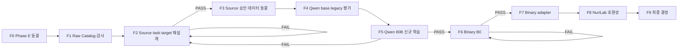

# Phase F 데이터 재설계·Qwen 재학습·바이너리 실험 계획

이 문서는 Phase F의 단일 기준 문서(SSOT)입니다. 단계별 실제 명령,
운영자 기록과 판정은
[FINETUNING_TEST_WORKBOOK.md](FINETUNING_TEST_WORKBOOK.md)에 남깁니다.

Phase F는 “데이터 수정 후 재학습”을 한 단계로 처리하지 않습니다.
실패 원인을 재학습 전에 차단하도록 F0~F9로 나눕니다.



## 현재 판정

| 단계 | 상태 | 핵심 근거 |
| --- | --- | --- |
| F0 | `Complete` | Phase E infrastructure PASS / quality FAIL |
| F1 | `Complete` | r2 group-first pool·taxonomy·reserve·2개 cross-dataset 재현성 감사 통과 |
| F2 | `Blocked — evidence supply` | source v1 contract 구현; core 11,500건 grounded evidence 0, 외부 pair 281건만 자동 gate 통과 |
| F3 | `Blocked by F2 evidence supply` | SARD/Juliet extractor와 grounded source 공급 필요 |
| F4 | `Blocked by F3` | 승인 challenge 필요 |
| F5 | `Blocked by F3/F4` | 신규 YAML·checkpoint guard도 필요 |
| F6-A | `Ready — 병행 조사 가능` | GPU 불필요 |
| F6-B | `Blocked by F5` | source adapter 판정 후 실행 |
| F7 | `Blocked by F6-B` | 검증된 binary pair 필요 |
| F8 | `Blocked by F5/F7` | 독립 adapter 결과 필요 |
| F9 | `Not Started` | 앞 단계 결과 필요 |

현재 다음 작업은 GPT-OSS 학습이나 Qwen 학습 시작이 아닙니다.
**F2 source output contract와 code-grounded target을 고치고 r2 pool에서
F3 학습 승인 데이터를 만드는 것**입니다.

## 최종 연구 질문

1. 코드 근거와 tokenizer 예산을 갖춘 1만 건 안팎의 source data를 만들 수
   있는가?
2. 그 데이터로 base에서 새로 학습한 Qwen3-Coder-Next 80B adapter가
   500건 절대 보안 gate를 통과하는가?
3. pseudo-C·정적 특징·제한된 assembly를 사용한 별도 adapter가 바이너리
   분석 절대 gate를 통과하는가?

Loss와 모델 간 상대순위는 성공 기준이 아닙니다.

---

## F0 — Phase E 종료와 증거 동결

상태: `Complete`

Qwen3-Coder-Next 80B Phase E 결과:

- 332,807건, 10,401 step, 1 epoch 학습 완료
- LoRA adapter 저장·재로드와 BF16 merge 완료
- Hugging Face API와 merged vLLM serving 완료
- 5건 smoke와 500건 label-blind 평가 완료

| 항목 | 결과 |
| --- | ---: |
| TP / FP / TN / FN | `84 / 116 / 0 / 166` |
| Precision | `0.420` |
| Recall | `0.336` |
| FPR | `0.464` |
| Abstention | `0.598` |
| JSON parse / schema | `0.556 / 0.530` |

Phase E 판정:

- infrastructure: `PASS`
- model quality: `FAIL`
- 결정: `데이터 수정 후 base에서 새 adapter 재학습`

기존 adapter, merged model, training config, trainer log, prediction,
evaluation summary와 hash는 실패 기준선으로 보존합니다. 이후 단계에서
덮어쓰거나 새 학습의 resume source로 사용하지 않습니다.

---

## F1 — 전체 Raw Catalog·범주화·감사

상태: `Complete`

### F1-A 원본 스냅샷

원본은 변환하지 않고 `data/raw_data/{dataset}`에 보존합니다.

| 디렉터리 | 고정 dataset/revision | 역할 |
| --- | --- | --- |
| `diversevul/` | `bstee615/diversevul@3ed5dae8...` | source core 후보 |
| `bigvul/` | `DynaOuchebara/BigVul@801dfa4f...` | verified pair cross-dataset holdout |
| `primevul/v0.1/` | Drive folder v0.1 + repository `6f54687...` | paired cross-dataset holdout |
| `sard-juliet-c-cpp-1.3/` | NIST suite #112, SHA-256 `ada9d7e1...` | raw build source, extractor 전 보류 |
| `cybersecurity-qa-v2/` | `rezaduty/cybersecurity-qa-v2@4b6f2780...` | provenance-only |

다운로드 로그와 checksum은 `_logs/`, `_manifests/`에 분리합니다.
라이선스 표기가 없거나 불명확하다는 사실은 자유 이용 허가를 뜻하지
않습니다. 현재는 내부 연구용으로 보존하며 공개·상용화 전 dataset mirror와
원 코드 라이선스를 별도 검토합니다.

### F1-B Catalog 결과

- raw catalog canonical record: `537,304`
- DiverseVul: `330,492`
- BigVul: 원본 `188,636`행 → verified fixed-after 포함 canonical `197,404`
- PrimeVul paired canonical: `9,408`
- eligible / quarantine / reject:
  `284,804 / 158,251 / 94,249`
- exact / near duplicate reject:
  `71,427 / 11,118`
- label 충돌 duplicate quarantine:
  `2,358 / 4,491`
- catalog에는 code와 executable payload를 넣지 않음

산출물:

```text
data/processed/phase-f-source-v2-r2/
├── raw_catalog.parquet
├── raw_dataset_inventory.json
├── eligible_manifest.parquet
├── selected_manifest.parquet
├── reserve_manifest.parquet
├── quarantine_manifest.parquet
├── reject_manifest.parquet
├── pools/{train,validation,test}.parquet
├── cross_dataset/{bigvul,primevul}/
├── train.jsonl
├── validation.jsonl
├── challenge.jsonl
├── gold.jsonl
├── dataset_manifest.json
└── SHA256SUMS
```

현재 r2 materialization은 F1 pool·분류 완료본입니다. F2 target과
tokenizer gate를 아직 통과하지 않았으므로 F3 학습 승인본과 동일하지
않습니다.

### F1-C 학습용 보안 범주화

기존 catalog에는 dataset, CWE, label, repository와 disposition만 있었고
sampler도 label/split 안에서 primary CWE와 repository 희소도에 가중치를
줄 뿐이었습니다. 현재 구현은 다음 taxonomy를 catalog와 manifest v2에
추가하고 language 비의존 category cell을 round-robin으로 표본추출합니다.

다음 축을 canonical taxonomy로 추가합니다.

| 축 | 값 예시 | 용도 |
| --- | --- | --- |
| `task_family` | source vulnerability, patch analysis, malware behavior, CTI, binary-derived | 서로 다른 학습 문제 분리 |
| `weakness_family` | memory safety, injection, access control, resource/lifetime, concurrency, numeric, crypto, information exposure, error handling, other | CWE 상위 범주 quota |
| `evidence_level` | label-only, CWE-scoped, patch-localized, code-span-grounded, analyzer-grounded | target 생성 가능 범위 결정 |
| `representation` | source, pseudo-C, assembly, static features | source/binary 표현 분리 |
| `pair_type` | unpaired, vulnerable-before, fixed-after | patch pair와 split 보존 |
| `length_bucket` | ≤512, 513–1024, 1025–2048, over-cutoff | token 편향과 cutoff 차단 |
| `label/confidence` | present, not_observed, uncertain + confidence | class와 신뢰도 quota |

#### Language 정책

Language는 taxonomy, sampling quota, model-visible prompt와 pass/fail gate에서
제외합니다. 원본 dataset이 값을 제공할 때만 provenance 감사용 metadata로
보존하고 코드 문법으로 언어를 추정하지 않습니다. `unknown`도 정상 입력으로
취급합니다.

연구 질문은 “무슨 언어인지 아는가”가 아니라, 언어 정보 없이도
취약 연산·데이터 흐름·위험 API·악성 행위 패턴을 찾을 수 있는가입니다.
Challenge에도 language label을 전달하지 않습니다.

### F1-D 범주별 분포와 quota

범주화 후 각 category cell의 eligible/quarantine/reject, source dataset,
label confidence, token 분포를 집계합니다. 무작위 추출은 이 category
cell 안에서만 고정 seed로 수행합니다. 부족한 cell은 다른 범주의 저신뢰
record로 채우지 않습니다.

#### Group-first pool과 materialization

모든 eligible record는 표본추출 전에 repository·function·patch group
hash로 `train_pool / validation_pool / test_pool` 중 하나에 배정합니다.
그 후에만 다음 고정 산출물을 선택합니다.

| 산출물 | 고정 수량 | 정책 |
| --- | ---: | --- |
| Train | 10,000 | positive/negative 5,000/5,000, core dataset만 |
| Validation | 1,000 | positive/negative 500/500 |
| Blind test | 500 | positive/negative 250/250 |
| Cross-dataset test | dataset별 200 | 학습에서 제외한 dataset, 가능하면 100 before/after pair |
| Reserve | 나머지 eligible 전부 | pool을 보존한 채 후속 seed·교체·확장용 |
| Quarantine | 불확실 record 전부 | pair·CWE·label·license 근거 개선 전 사용 금지 |

`BigVul`은 verified before/after·patch pair만 eligible로 승격하고 core
학습에는 넣지 않은 채 cross-dataset holdout으로 사용합니다.
fixed-after의 `not_observed`는 해당 target CWE가 patch 후 관찰되지
않는다는 뜻이며 프로그램 전체가 안전하다는 뜻이 아닙니다.

PrimeVul도 paired JSONL만 cross-dataset holdout으로 사용합니다. 기존
데이터셋 재구성으로 생긴 exact·near duplicate를 전역 제거한 결과
eligible 370건만 남았으며 그중 완전한 100 pair를 선택했습니다. 공식
paired 파일에서 provenance가 서로 다른 예외 1쌍은 자동 quarantine했습니다.

산출물 계약:

- `eligible_manifest.parquet`: 모든 eligible의 pool과 materialization 상태
- `selected_manifest.parquet`: train·validation·blind·cross 선택본
- `reserve_manifest.parquet`: 선택되지 않은 모든 eligible
- `quarantine_manifest.parquet`, `reject_manifest.parquet`
- `pools/{train,validation,test}.parquet`
- `cross_dataset/{dataset}/challenge.jsonl`, `gold.jsonl`

### F1-E 추가 raw dataset 후보

추가 데이터는 역할을 분리해 확보합니다.

| 우선순위 | Dataset | Phase F 역할 | 주의점 |
| --- | --- | --- | --- |
| 1 | PrimeVul | 현실적인 source 취약점과 vulnerable/fixed paired evaluation | 기존 dataset 재구성본이므로 commit/function dedup 필수 |
| 1 | NIST SARD/Juliet | 명시적 weakness와 build 가능한 source로 code-grounding·binary pair 생성 | synthetic 비중이 과도해지지 않도록 별도 quota |
| 2 | MegaVul | CVE/fix commit, 함수·graph representation 보강 | GPL-3.0, 대용량, 기존 BigVul/DiverseVul 중복 |
| 2 | CVEfixes/MoreFixes | vulnerability-fixing commit과 patch 근거 보강 | 실제 code fetch 시 원 repository license 확인 |

현재 BigVul raw에는 `func_before`, `func_after`, `lines_before`,
`lines_after`, `patch`가 있으므로 새 dataset을 받기 전에 normalizer가 이
근거를 활용하지 못한 문제부터 수정합니다.

### F1 통과 기준

- 모든 raw record가 catalog에 누락 없이 등록
- provenance, source/content hash, group과 disposition 보존
- catalog payload에 source code·raw executable 없음
- exact·near duplicate와 label 충돌 수치 재현
- model-visible leakage와 split group leakage를 계량 가능
- 모든 eligible record에 language를 제외한 taxonomy 값 부여
- category별 class·evidence·length 분포와 quota 확정
- sampler가 category cell별 quota와 고정 seed를 실제 적용
- 같은 raw·config·seed에서 같은 논리 결과 재생성

### F1 완료 증거

- Train / validation / blind:
  `10,000 / 1,000 / 500`
- 각 core split의 positive/negative: `1:1`
- BigVul cross: `200`, 완전한 before/fixed pair `100`
- PrimeVul cross: `200`, 완전한 before/fixed pair `100`
- Reserve: `272,904`
- Quarantine / reject: `158,251 / 94,249`
- selected/reserve overlap, eligible partition 누락, group pool leakage: `0`
- 모든 eligible taxonomy 필드 누락: `0`
- model-visible 입력 검사: `11,900`, 누출·language control key `0`
- 동일 raw·config·seed 재생성 artifact 19개 SHA-256 불일치: `0`
- artifact root:
  `/NHNHOME/WORKSPACE/26moel002_ex07/LLM/Data/processed/phase-f-source-v2-r2`
- `SHA256SUMS` hash:
  `b17fa32296042ebc9377dcef8915aeabaac895d9ed682cef096fa08328de87e6`

---

## F2 — Source Task·Output Contract·Target 재설계

상태: `Blocked — evidence supply`

이 단계의 목표는 label을 맞히는 문구를 외우게 하는 것이 아니라, 제공된
코드에서 관찰 가능한 근거로 target CWE를 판단하게 하는 것입니다.

### 발견된 실패

현재 `phase-f-source-v2` 10,000건을 실제 Qwen tokenizer와 target
content 기준으로 다시 감사했습니다.

| 항목 | 결과 |
| --- | ---: |
| exact unique output | `939 / 10,000` |
| 상위 4개 exact output | `5,000 / 10,000` |
| unique summary | `8` |
| positive evidence | generic 문장 사실상 `1`종 |
| cutoff 2,048 초과 train | `927 / 10,000` (`9.27%`) |
| cutoff 초과 validation | `121 / 1,000` (`12.10%`) |
| cutoff 초과 challenge | `46 / 500` (`9.20%`) |
| 초과 train positive / negative | `781 / 146` |

문제는 네 가지입니다.

1. Positive 정답이 실제 취약 연산이나 line span 대신 “scoped weakness
   task에서 positive”라는 문구를 반복합니다.
2. CWE source 판별을 CTI/malware 보고용 `risk_level`,
   `malware_like_behaviors`, ATT&CK schema에 억지로 넣었습니다.
3. 2,048-token 오른쪽 절단 시 긴 positive와 assistant target이 더 많이
   손실될 수 있습니다.
4. DiverseVul label만으로는 정확한 취약 line 근거를 만들 수 없는데도
   설명 정답을 생성했습니다.

### Source vulnerability 전용 contract

F2에서 versioned contract를 새로 추가합니다.

```text
scope.target_cwe
assessment: present | not_observed | uncertain
findings:
  - location 또는 code span
  - operation
  - explanation
  - confidence
limitations
recommendations
```

규칙:

- `not_observed`는 제공된 함수와 target CWE 범위에만 적용
- dataset, source, record ID, split, target label은 prompt에서 제거
- CWE 자체는 검사 범위이므로 prompt에 표시 가능
- positive finding은 실제 code span·operation·patch와 연결
- 근거가 없으면 `uncertain` 또는 학습 제외
- negative는 프로그램 전체가 안전하다고 주장하지 않음
- ATT&CK mapping은 source vulnerability contract에서 제거
- 네 prompt template의 의미와 class 분포는 동일하게 유지

### 데이터 역할 분리

- DiverseVul: label 신뢰도를 통과한 target-CWE 분류 후보
- BigVul: `func_before/func_after`, `lines_before/lines_after`, patch 위치가
  연결된 record만 설명·근거 SFT 후보
- 근거 없는 label-only record: rich explanation target을 만들지 않음
- Cybersecurity QA: 이번 source vulnerability SFT에서 제외

### F2 통과 기준

- model-visible label·dataset·split·provenance leakage 0
- prompt template와 label 간 상관 없음
- positive finding의 code/patch 연결률 ≥ `0.95`
- generic positive evidence 0
- exact target 중복률 ≤ `0.05`
- 단일 target template 비중 ≤ `0.02`
- negative의 전역 안전 주장 0
- schema validation `1.00`
- 100건 수동 검토의 label/근거 오류율 ≤ `0.05`

F2가 실패하면 dataset 수를 채우거나 GPU 학습으로 넘어가지 않습니다.

### 2026-07-29 F2 실제 감사 결과

- source record/output contract:
  `aegislm.source-vulnerability-record.v1` /
  `aegislm.source-vulnerability-assessment.v1`
- 실제 tokenizer: `model/base/qwen3-coder-next`, thinking 비활성 chat template
- 감사 레코드: core 11,500 + BigVul·PrimeVul pair holdout 400 = 11,900
- core 학습 eligible: `0`
- 외부 pair 중 target 생성: `349`
- 2,048-token 초과 제외: `68`
- 최종 자동 품질 gate 통과: `281`
- grounded evidence 부족: `11,500`
- patch span 생성 실패: `51`
- 최종 281건의 schema·prompt leakage·positive linkage·generic evidence·
  exact duplicate·single target·global safety·cutoff gate: 모두 PASS
- quota gate: 전부 FAIL
- audit artifact:
  `data/processed/phase-f-source-v2-r2/f2/source-target-audit.json`
- SHA-256:
  `0419b36cc6c61eaf5f00f6ae8bc88a88cb2535280f66efce5e44ab5e0f88fae4`

따라서 F2는 모델이나 loss 문제가 아니라 **grounded source evidence 공급
부족**으로 중단합니다. BigVul·PrimeVul의 외부 test 역할은 유지하며,
다음 작업은 SARD/Juliet function-level good/bad extractor입니다.

---

## F3 — Source Dataset 승인본 구축과 동결

상태: `Blocked by F2`

현재 `phase-f-source-v2`는 실패 분석용으로 동결합니다. 수정본은 덮어쓰지
않고 다음 경로에 생성합니다.

```text
data/processed/phase-f-source-v3
```

목표 구성:

- train: 최대 10,000, positive/negative 1:1
- validation: 1,000, positive/negative 1:1
- blind challenge/gold: 500, positive/negative 250/250
- BigVul 보강: 검증된 pair만 최대 2,000
- seed: `20260728`
- split: repository/function/patch group 단위

10,000건을 채우기 위해 저신뢰 record를 넣지 않습니다. F2 gate를 통과한
record가 부족하면 실제 수량을 줄여 동결합니다.

### Token budget

- tokenizer: `model/base/qwen3-coder-next`
- training `cutoff_len`: `2048`
- system+user+assistant total token이 2,048 이하인 record만 승인
- blind right truncation 금지
- class별 token 분포와 제외 수 기록
- challenge도 serving prompt+generation budget을 사전 검증

### F3 산출물

- `eligible_manifest.parquet`
- `train.jsonl`, `validation.jsonl`
- `challenge.jsonl`, 별도 `gold.jsonl`
- LLaMA-Factory train/validation shard와 `dataset_info.json`
- `dataset_manifest.json`
- target-quality/token audit summary
- `SHA256SUMS`

### F3 통과 기준

- F2 target gate 전부 통과
- train/validation/challenge group·content overlap 0
- challenge와 gold 분리
- prompt leakage 0
- tokenizer cutoff 초과 0
- canonical → JSONL → prompt 왕복 검사
- 동일 seed 재생성 hash 일치
- artifact hash 동결 후 학습 중 데이터 변경 금지

---

## F4 — Qwen Base와 Phase E Legacy Adapter 평가

상태: `Blocked by F3`

F4는 새 학습 전에 task·contract·evaluator가 실제 모델 호출에서 작동하는지
검증합니다.

### Q0-B — Qwen 80B Base

1. 승인 challenge 고정 20건 smoke
2. JSON parse/schema, 누락, 반복, timeout 확인
3. 통과하면 전체 500건 absolute evaluation

### Q0-E — Phase E Legacy Adapter

같은 20건과 500건을 기존 Phase E merged model에 실행합니다. 목적은
기존 adapter를 label/provenance가 제거된 새 평가에서 최종 판정하는
것입니다.

두 run은 각각 절대 gate로 판정합니다. 모델 간 차이는 오류 원인과 비용을
설명하는 보조 자료일 뿐 상대 우승 모델을 고르는 기준이 아닙니다.

F4가 contract나 evaluator 오류로 실패하면 F2/F3로 돌아갑니다. 단순히
base 또는 legacy 모델의 품질이 낮다는 이유로 새 Qwen 학습을 막지는
않습니다.

---

## F5 — Qwen3-Coder-Next 80B 신규 LoRA 학습

상태: `Blocked by F3/F4`

Qwen 80B는 현재 주 실험입니다. GPT-OSS-20B는 Qwen의 선행 gate가 아닙니다.

### 학습 사전 수정

기존 Phase E YAML과 runner는 다음 값을 고정하고 있어 그대로 사용하면
안 됩니다.

- old dataset: `data/llamafactory`
- old output: `training_artifacts/qwen3-coder-next/lora/full`
- old checkpoint auto-resume: Phase E `checkpoint-10401`
- old mirror/run namespace

학습 전에:

1. Qwen Phase F 전용 `100/250/313` step YAML을 만듭니다.
2. dataset은 F3 승인본의 LLaMA-Factory shard만 가리킵니다.
3. artifact namespace를
   `training_artifacts/qwen3-coder-next/lora/phase-f-source-v3`로
   분리합니다.
4. runner가 Phase E checkpoint를 resume하려 하면 즉시 실패하게 합니다.
5. base revision, Git commit/dirty 이유, dataset/config hash를 동결합니다.
6. 실행 중 serving process를 기록·종료하고 GPU idle을 확인합니다.

재감사 시점에는 Phase E merged vLLM이 `127.0.0.1:8000`에서 실행 중이며
worker당 약 `171,762 MiB`를 사용하고 있었습니다. 이는 서빙 측정값이며
학습 peak gate와 섞지 않습니다.

### Q1 — 신규 100 step

- base model에서 새 LoRA 시작
- Phase E adapter/checkpoint resume 금지
- global batch 32
- 100 optimizer step
- checkpoint save/reload
- LoRA adapter API serving
- 승인 challenge 500건 진단 평가

진단 gate:

- prediction 누락 0
- parse/schema ≥ `0.99`
- safety = `1.00`
- abstention ≤ `0.10`
- precision·recall 각각 ≥ `0.75`
- FPR ≤ `0.20`
- positive·negative prediction 모두 존재
- 반복·비정상 길이 ≤ `0.01`

### Q2 — 총 250 step

Q1을 통과했을 때만 같은 Phase F checkpoint에서 resume합니다. Q2 완료 후
전체 500건 absolute evaluation을 수행합니다.

### Q3 — 총 313 step, 선택

Train 10,000건, global batch 32에서 1 epoch는 약 313 step입니다. Q0→Q1→Q2
품질이 계속 개선되고 final gate에 근접할 때만 Q3를 수행합니다. 두 평가
지점 연속 개선이 없으면 중단합니다.

### 최종 gate

- precision ≥ `0.90`
- recall ≥ `0.95`
- FPR ≤ `0.05`
- abstention ≤ `0.05`
- parse/schema ≥ `0.99`
- safety = `1.00`
- evidence linkage ≥ `0.90`

Loss는 기록만 하고 진행·채택 gate로 사용하지 않습니다.

### Merge와 vLLM

149 GiB merge를 모든 checkpoint마다 만들지 않습니다. Q2 또는 Q3에서
채택 후보가 생겼을 때만 BF16 merge 후 vLLM TP2로 검증합니다. 기존
환경에서 dynamic MoE LoRA vLLM은 hang, merged vLLM은 성공했기 때문입니다.

### GPT-OSS-20B의 위치

Qwen F5 결론 이후 필요할 때만 별도 100-step 이식성 실험을 합니다.

- 같은 source contract/evaluator의 타 모델 호환성
- 작은 모델의 비용·속도 기준선
- 차기 GPT-OSS-120B preflight 준비

GPT-OSS 결과는 Qwen Q1~Q3의 시작·중단 조건이 아닙니다.

---

## F6 — Binary 데이터 조사와 B0 Feasibility

### F6-A 후보·라이선스·저장 조사

상태: `Ready — F2~F5와 병행 가능`

Binary 후보는 같은 목적으로 한데 섞지 않고 다음 역할로 분리합니다.

| 우선순위 | 후보 | Phase F 역할 | 사용 경계 |
| --- | --- | --- | --- |
| 1 | 현재 BigVul의 verified before/after·patch | target CWE가 있는 source–binary pair의 1차 원천 | 현재 normalizer가 버린 `func_after`, 변경 line, patch를 먼저 복구 |
| 1 | NIST SARD/Juliet buildable source | 명시적 weakness의 자체 컴파일·decompile B0 | synthetic 비중을 별도 quota로 제한 |
| 2 | Assemblage 소규모 정렬 subset | source–PE/ELF–function 정렬과 extractor 검증 | 전체 corpus를 받지 않고 metadata와 필요한 함수 subset만 |
| 2 | Decompile-Bench/LLM4Decompile shard | pseudo-C 표현과 decompiler 품질 연구 | 전체 약 450 GB를 받지 않고 정해진 shard만 |
| 3 | BinKit 2.0 subset | architecture/compiler/optimization 강건성 평가 | 취약점 label 학습용으로 사용하지 않음 |
| 3 | EMBER2024 feature subset | malware static-feature 독립 절대평가 | source CWE adapter에 직접 혼합하지 않음 |

Phase F의 첫 binary 데이터는 외부 실행파일을 모으는 방식보다 검증된
before/after source를 직접 컴파일해 만듭니다. GCC·Clang과 `O0/O2`로
학습 조건을 만들고, `O3 + stripped`는 보지 않은 강건성 조건으로
남깁니다. 이 방식은 source label, patch 위치, 생성 binary와 pseudo-C를
같은 function ID로 연결할 수 있어 B0의 ground truth가 가장 명확합니다.

외부 후보는 먼저 dataset card·license·파일 목록·압축 크기·추출 후 예상
크기를 manifest에 기록한 뒤 필요한 subset만 받습니다. 특히 다음 대형
download는 B0 이전에 시작하지 않습니다.

- Decompile-Bench 전체 약 450 GB
- BinKit 전체 371,928 binaries
- Assemblage 전체 PE/ELF corpus
- SOREL-20M, BODMAS, BIG 2015의 raw/disarmed malware payload

EMBER2024는 raw malware 수집 대신 공개된 static feature와 label을 먼저
사용합니다. 초기 후보는 작은 ELF 또는 challenge/feature subset이며,
`family`, `behavior`, `packer`, `exploit` 같은 tag가 실제 모델 근거로
표현 가능한지 먼저 확인합니다.

Raw executable, byte dump, live/disarmed malware는 Git, prompt, Parquet
payload에 넣지 않습니다. 외부 artifact 경로와 SHA-256만 catalog에 둡니다.

F6-A 산출물:

- `data/raw_data/_manifests/binary_candidate_inventory.json`
- source URL, revision, license/terms, 파일 목록과 크기
- `training / target-builder / robustness / evaluation / hold` 역할
- raw executable 포함 여부와 안전한 subset 경계
- compiler/decompiler 이름, version, image digest

### F6-B B0 100 pair

상태: `Blocked by F5`

- build 가능한 before/after 100 pair, 총 200 함수
- GCC·Clang, `O0/O2`
- pseudo-C
- imports·sections·strings·symbols
- 제한된 assembly evidence

Gate:

- compile ≥ `0.90`
- decompile ≥ `0.90`
- source–binary–function 연결 ≥ `0.95`
- target CWE와 patch 위치 보존
- raw payload prompt 유입 0
- provenance·label·split 유입 0

실패하면 규모를 늘리지 않고 extractor/build recipe를 수정합니다.

---

## F7 — Binary Dataset v1과 별도 Adapter

상태: `Blocked by F6-B`

- pair 최대 2,000
- before `present`: 최대 2,000
- after `not_observed`: 최대 2,000
- validation 400
- blind test 500
- robustness: 학습에 없는 `O3 + stripped`
- compiler consistency: 동일 함수 100건

Source adapter와 섞지 않고 별도 학습·평가합니다.

추가 gate:

- compiler consistency ≥ `0.95`
- pseudo-C·assembly·static feature evidence linkage ≥ `0.90`
- source symbol·dataset provenance 의존 0
- raw byte·payload 출력 0

검증된 pair가 부족하면 저신뢰 데이터로 채우지 않고 B0 결과만 남깁니다.

---

## F8 — NuriLab 호환성과 Handoff

상태: `Blocked by F5/F7`

NuriLab 또는 승인된 offline extractor가 다음 normalized record를
생성합니다.

- file hash, format, architecture
- analyzer/decompiler와 version
- function ID·hash
- pseudo-C
- bounded assembly evidence
- imports·sections·strings·symbols
- extraction warning/failure
- raw artifact의 외부 reference

AegisLM은 dataset 이름, label, split, 원본 경로를 제외하고 이를 prompt로
변환합니다.

검증 순서:

1. source adapter
2. binary adapter
3. NuriLab normalized signals
4. source+binary multitask
5. signals+RAG
6. signals+RAG/MCP

각 단계는 독립 absolute gate를 적용합니다.

---

## F9 — Phase F 최종 결정

다음 중 하나를 근거와 함께 확정합니다.

- `채택`
- `Source만 채택`
- `데이터 수정 후 재학습`
- `모델 변경`
- `파인튜닝 연구 중단`
- `Phase G 진입`

Raw byte 직접 학습, byte-level tokenizer/model, live malware 실행과 새
아키텍처 연구는 Phase G에만 둡니다.

---

## 공통 중단 기준

- prompt label/source/provenance leakage 발견
- generic evidence 또는 code-grounding gate 실패
- tokenizer cutoff 초과 record가 승인 데이터에 포함
- Phase E checkpoint가 Phase F run에 resume됨
- checkpoint 저장·재로드 실패
- 학습 중 GPU당 peak VRAM 약 165 GiB 초과
- prediction 누락·반복 출력 5% 초과
- negative prediction 0으로 붕괴
- 두 평가 지점 연속 품질 개선 없음
- 12시간 이상 checkpoint·평가 없이 학습 지속
- binary pair/CWE 정렬 실패

## 구현·문서 다음 순서

1. source vulnerability schema·prompt·evaluator 구현
2. code-grounded target builder와 token audit 구현
3. F2 target·token gate를 적용한 `phase-f-source-v3` 생성·수동 100건 감사·동결
4. Phase F Qwen YAML과 checkpoint namespace guard 구현
5. Q0-B/Q0-E 실행
6. Q1 100-step 신규 학습
7. gate에 따라 Q2 250-step, 선택적 Q3 313-step
8. 최종 후보 merge·vLLM
9. F6 이후 진행 여부 결정

검증 명령:

```bash
uv run pytest
uv run ruff check .
uv run ruff format --check .
uv run mypy aegislm/ tests/
```
