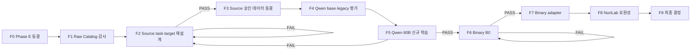

# Phase F 데이터 재설계·Qwen 재학습·바이너리 실험 계획

이 문서는 Phase F의 단일 기준 문서(SSOT)입니다. 단계별 실제 명령,
운영자 기록과 판정은
[FINETUNING_TEST_WORKBOOK.md](../../operations/b200/FINETUNING_TEST_WORKBOOK.md)에 남깁니다.

Phase F는 “데이터 수정 후 재학습”을 한 단계로 처리하지 않습니다.
실패 원인을 재학습 전에 차단하도록 F0~F9로 나눕니다.



## 현재 판정

| 단계 | 상태 | 핵심 근거 |
| --- | --- | --- |
| F0 | `Complete` | Phase E infrastructure PASS / quality FAIL |
| F1 | `Complete` | r2 group-first pool·taxonomy·reserve·2개 cross-dataset 재현성 감사 통과 |
| F2 | `Complete` | line-range evidence 계약과 strict renderer를 확정하고 Q1R11에서 최종 검증 |
| F3 | `Complete` | `phase-f-source-v3` 전체 gate·결정적 재빌드 hash 통과, 학습 승인 |
| F4 | `Complete — smoke FAIL` | base·legacy 모두 source-v2 schema `0/20`; oracle `20/20` PASS |
| F5 | `Complete — lifecycle PASS with constrained decoding` | 두 BF16 merge·vLLM TP2 완료; guided JSON Schema와 semantic validator에서 전체 gate PASS |
| F5-X | `Ready — preflight only` | Mistral Small 4 119B A6B decision-only Axolotl QLoRA 1/10/100-step; evidence·full run 미승인 |
| F6-A | `Complete` | 후보·license·local source·toolchain inventory 동결 |
| F6-B | `Complete — strict re-audit 99/145` | 최초 100 pair 중 CWE-563 1 pair 추가 격리; 부족분은 F7에서 대체 |
| F7 | `Running — target v1–v5·v7·v9 manual FAIL; contract redesign` | v7·v9 자동 PASS 뒤 수동 6-error FAIL; v8 공급 2,326/2,450; frozen queue 소진 |
| F8 | `Blocked by F7 adapter` | binary adapter 독립 절대평가 필요 |
| F9 | `Not Started` | 앞 단계 결과 필요 |

Q1R10 decision과 Q1R11 evidence의 신규 blind 500건 model-only 평가와
각 adapter의 BF16 merge·vLLM TP2 lifecycle을 완료했습니다. Evidence
serving은 `response_format=json_schema` constrained decoding과 semantic
validator를 필수조건으로 사용합니다. 재현 가능한 Clang+Ghidra 환경과
1-pair extractor smoke와 relation·tokenizer lifecycle까지 검증했습니다.
그러나 target v1–v5·v7·v9 수동 근거 gate가 실패했으므로 binary adapter
canary는 금지 상태입니다. 다음 작업은 flat evidence line 선택을
source/control/sink/bound 관계가 명시된 versioned role-structured
contract로 교체하고 새 고정 100건 수동 검토를 통과하는 것입니다.

`aegislm.binary-role-assessment-output.v2` schema와 semantic validator는
구현을 시작했습니다. evidence ID·exact span·role과 sink-directed
relation을 검증하며, v1 target artifact를 변경하지 않습니다. 남은 순서는
v2 target builder, tokenizer/supply gate, model-ready materialization,
고정 100건 수동 review입니다.
NuriLab·RAG/MCP는 기존 순서대로 뒤에 둡니다. 교차 모델 검증은 Qwen
source 결론이 이미 확정됐으므로 F5-X에서 별도로 수행합니다.

## 최종 연구 질문

1. 코드 근거와 tokenizer 예산을 갖춘 1만 건 안팎의 source data를 만들 수
   있는가?
2. 그 데이터로 base에서 새로 학습한 Qwen3-Coder-Next 80B adapter가
   500건 절대 보안 gate를 통과하는가?
3. pseudo-C·정적 특징·제한된 assembly를 사용한 별도 adapter가 바이너리
   분석 절대 gate를 통과하는가?

Loss와 모델 간 상대순위는 성공 기준이 아닙니다.

---

## F0 — Phase E 종료와 증거 동결

상태: `Complete`

Qwen3-Coder-Next 80B Phase E 결과:

- 332,807건, 10,401 step, 1 epoch 학습 완료
- LoRA adapter 저장·재로드와 BF16 merge 완료
- Hugging Face API와 merged vLLM serving 완료
- 5건 smoke와 500건 label-blind 평가 완료

| 항목 | 결과 |
| --- | ---: |
| TP / FP / TN / FN | `84 / 116 / 0 / 166` |
| Precision | `0.420` |
| Recall | `0.336` |
| FPR | `0.464` |
| Abstention | `0.598` |
| JSON parse / schema | `0.556 / 0.530` |

Phase E 판정:

- infrastructure: `PASS`
- model quality: `FAIL`
- 결정: `데이터 수정 후 base에서 새 adapter 재학습`

기존 adapter, merged model, training config, trainer log, prediction,
evaluation summary와 hash는 실패 기준선으로 보존합니다. 이후 단계에서
덮어쓰거나 새 학습의 resume source로 사용하지 않습니다.

---

## F1 — 전체 Raw Catalog·범주화·감사

상태: `Complete`

### F1-A 원본 스냅샷

원본은 변환하지 않고 `data/raw_data/{dataset}`에 보존합니다.

| 디렉터리 | 고정 dataset/revision | 역할 |
| --- | --- | --- |
| `diversevul/` | `bstee615/diversevul@3ed5dae8...` | source core 후보 |
| `bigvul/` | `DynaOuchebara/BigVul@801dfa4f...` | verified pair cross-dataset holdout |
| `primevul/v0.1/` | Drive folder v0.1 + repository `6f54687...` | paired cross-dataset holdout |
| `sard-juliet-c-cpp-1.3/` | NIST suite #112, SHA-256 `ada9d7e1...` | raw build source, extractor 전 보류 |
| `cybersecurity-qa-v2/` | `rezaduty/cybersecurity-qa-v2@4b6f2780...` | provenance-only |

다운로드 로그와 checksum은 `_logs/`, `_manifests/`에 분리합니다.
라이선스 표기가 없거나 불명확하다는 사실은 자유 이용 허가를 뜻하지
않습니다. 현재는 내부 연구용으로 보존하며 공개·상용화 전 dataset mirror와
원 코드 라이선스를 별도 검토합니다.

### F1-B Catalog 결과

- raw catalog canonical record: `537,304`
- DiverseVul: `330,492`
- BigVul: 원본 `188,636`행 → verified fixed-after 포함 canonical `197,404`
- PrimeVul paired canonical: `9,408`
- eligible / quarantine / reject:
  `284,804 / 158,251 / 94,249`
- exact / near duplicate reject:
  `71,427 / 11,118`
- label 충돌 duplicate quarantine:
  `2,358 / 4,491`
- catalog에는 code와 executable payload를 넣지 않음

산출물:

```text
data/processed/phase-f-source-v2-r2/
├── raw_catalog.parquet
├── raw_dataset_inventory.json
├── eligible_manifest.parquet
├── selected_manifest.parquet
├── reserve_manifest.parquet
├── quarantine_manifest.parquet
├── reject_manifest.parquet
├── pools/{train,validation,test}.parquet
├── cross_dataset/{bigvul,primevul}/
├── train.jsonl
├── validation.jsonl
├── challenge.jsonl
├── gold.jsonl
├── dataset_manifest.json
└── SHA256SUMS
```

현재 r2 materialization은 F1 pool·분류 완료본입니다. F2 target과
tokenizer gate를 아직 통과하지 않았으므로 F3 학습 승인본과 동일하지
않습니다.

### F1-C 학습용 보안 범주화

기존 catalog에는 dataset, CWE, label, repository와 disposition만 있었고
sampler도 label/split 안에서 primary CWE와 repository 희소도에 가중치를
줄 뿐이었습니다. 현재 구현은 다음 taxonomy를 catalog와 manifest v2에
추가하고 language 비의존 category cell을 round-robin으로 표본추출합니다.

다음 축을 canonical taxonomy로 추가합니다.

| 축 | 값 예시 | 용도 |
| --- | --- | --- |
| `task_family` | source vulnerability, patch analysis, malware behavior, CTI, binary-derived | 서로 다른 학습 문제 분리 |
| `weakness_family` | memory safety, injection, access control, resource/lifetime, concurrency, numeric, crypto, information exposure, error handling, other | CWE 상위 범주 quota |
| `evidence_level` | label-only, CWE-scoped, patch-localized, code-span-grounded, analyzer-grounded | target 생성 가능 범위 결정 |
| `representation` | source, pseudo-C, assembly, static features | source/binary 표현 분리 |
| `pair_type` | unpaired, vulnerable-before, fixed-after | patch pair와 split 보존 |
| `length_bucket` | ≤512, 513–1024, 1025–2048, over-cutoff | token 편향과 cutoff 차단 |
| `label/confidence` | present, not_observed, uncertain + confidence | class와 신뢰도 quota |

#### Language 정책

Language는 taxonomy, sampling quota, model-visible prompt와 pass/fail gate에서
제외합니다. 원본 dataset이 값을 제공할 때만 provenance 감사용 metadata로
보존하고 코드 문법으로 언어를 추정하지 않습니다. `unknown`도 정상 입력으로
취급합니다.

연구 질문은 “무슨 언어인지 아는가”가 아니라, 언어 정보 없이도
취약 연산·데이터 흐름·위험 API·악성 행위 패턴을 찾을 수 있는가입니다.
Challenge에도 language label을 전달하지 않습니다.

### F1-D 범주별 분포와 quota

범주화 후 각 category cell의 eligible/quarantine/reject, source dataset,
label confidence, token 분포를 집계합니다. 무작위 추출은 이 category
cell 안에서만 고정 seed로 수행합니다. 부족한 cell은 다른 범주의 저신뢰
record로 채우지 않습니다.

#### Group-first pool과 materialization

모든 eligible record는 표본추출 전에 repository·function·patch group
hash로 `train_pool / validation_pool / test_pool` 중 하나에 배정합니다.
그 후에만 다음 고정 산출물을 선택합니다.

| 산출물 | 고정 수량 | 정책 |
| --- | ---: | --- |
| Train | 10,000 | positive/negative 5,000/5,000, core dataset만 |
| Validation | 1,000 | positive/negative 500/500 |
| Blind test | 500 | positive/negative 250/250 |
| Cross-dataset test | dataset별 200 | 학습에서 제외한 dataset, 가능하면 100 before/after pair |
| Reserve | 나머지 eligible 전부 | pool을 보존한 채 후속 seed·교체·확장용 |
| Quarantine | 불확실 record 전부 | pair·CWE·label·license 근거 개선 전 사용 금지 |

`BigVul`은 verified before/after·patch pair만 eligible로 승격하고 core
학습에는 넣지 않은 채 cross-dataset holdout으로 사용합니다.
fixed-after의 `not_observed`는 해당 target CWE가 patch 후 관찰되지
않는다는 뜻이며 프로그램 전체가 안전하다는 뜻이 아닙니다.

PrimeVul도 paired JSONL만 cross-dataset holdout으로 사용합니다. 기존
데이터셋 재구성으로 생긴 exact·near duplicate를 전역 제거한 결과
eligible 370건만 남았으며 그중 완전한 100 pair를 선택했습니다. 공식
paired 파일에서 provenance가 서로 다른 예외 1쌍은 자동 quarantine했습니다.

산출물 계약:

- `eligible_manifest.parquet`: 모든 eligible의 pool과 materialization 상태
- `selected_manifest.parquet`: train·validation·blind·cross 선택본
- `reserve_manifest.parquet`: 선택되지 않은 모든 eligible
- `quarantine_manifest.parquet`, `reject_manifest.parquet`
- `pools/{train,validation,test}.parquet`
- `cross_dataset/{dataset}/challenge.jsonl`, `gold.jsonl`

### F1-E 추가 raw dataset 후보

추가 데이터는 역할을 분리해 확보합니다.

| 우선순위 | Dataset | Phase F 역할 | 주의점 |
| --- | --- | --- | --- |
| 1 | PrimeVul | 현실적인 source 취약점과 vulnerable/fixed paired evaluation | 기존 dataset 재구성본이므로 commit/function dedup 필수 |
| 1 | NIST SARD/Juliet | 명시적 weakness와 build 가능한 source로 code-grounding·binary pair 생성 | synthetic 비중이 과도해지지 않도록 별도 quota |
| 2 | MegaVul | CVE/fix commit, 함수·graph representation 보강 | GPL-3.0, 대용량, 기존 BigVul/DiverseVul 중복 |
| 2 | CVEfixes/MoreFixes | vulnerability-fixing commit과 patch 근거 보강 | 실제 code fetch 시 원 repository license 확인 |

현재 BigVul raw에는 `func_before`, `func_after`, `lines_before`,
`lines_after`, `patch`가 있으므로 새 dataset을 받기 전에 normalizer가 이
근거를 활용하지 못한 문제부터 수정합니다.

### F1 통과 기준

- 모든 raw record가 catalog에 누락 없이 등록
- provenance, source/content hash, group과 disposition 보존
- catalog payload에 source code·raw executable 없음
- exact·near duplicate와 label 충돌 수치 재현
- model-visible leakage와 split group leakage를 계량 가능
- 모든 eligible record에 language를 제외한 taxonomy 값 부여
- category별 class·evidence·length 분포와 quota 확정
- sampler가 category cell별 quota와 고정 seed를 실제 적용
- 같은 raw·config·seed에서 같은 논리 결과 재생성

### F1 완료 증거

- Train / validation / blind:
  `10,000 / 1,000 / 500`
- 각 core split의 positive/negative: `1:1`
- BigVul cross: `200`, 완전한 before/fixed pair `100`
- PrimeVul cross: `200`, 완전한 before/fixed pair `100`
- Reserve: `272,904`
- Quarantine / reject: `158,251 / 94,249`
- selected/reserve overlap, eligible partition 누락, group pool leakage: `0`
- 모든 eligible taxonomy 필드 누락: `0`
- model-visible 입력 검사: `11,900`, 누출·language control key `0`
- 동일 raw·config·seed 재생성 artifact 19개 SHA-256 불일치: `0`
- artifact root:
  `<REDACTED_SERVER_PATH>/Data/processed/phase-f-source-v2-r2`
- `SHA256SUMS` hash:
  `b17fa32296042ebc9377dcef8915aeabaac895d9ed682cef096fa08328de87e6`

---

## F2 — Source Task·Output Contract·Target 재설계

상태: `Complete — SARD grounded v2 automated/manual gate PASS`

이 단계의 목표는 label을 맞히는 문구를 외우게 하는 것이 아니라, 제공된
코드에서 관찰 가능한 근거로 target CWE를 판단하게 하는 것입니다.

### 발견된 실패

현재 `phase-f-source-v2` 10,000건을 실제 Qwen tokenizer와 target
content 기준으로 다시 감사했습니다.

| 항목 | 결과 |
| --- | ---: |
| exact unique output | `939 / 10,000` |
| 상위 4개 exact output | `5,000 / 10,000` |
| unique summary | `8` |
| positive evidence | generic 문장 사실상 `1`종 |
| cutoff 2,048 초과 train | `927 / 10,000` (`9.27%`) |
| cutoff 초과 validation | `121 / 1,000` (`12.10%`) |
| cutoff 초과 challenge | `46 / 500` (`9.20%`) |
| 초과 train positive / negative | `781 / 146` |

문제는 네 가지입니다.

1. Positive 정답이 실제 취약 연산이나 line span 대신 “scoped weakness
   task에서 positive”라는 문구를 반복합니다.
2. CWE source 판별을 CTI/malware 보고용 `risk_level`,
   `malware_like_behaviors`, ATT&CK schema에 억지로 넣었습니다.
3. 2,048-token 오른쪽 절단 시 긴 positive와 assistant target이 더 많이
   손실될 수 있습니다.
4. DiverseVul label만으로는 정확한 취약 line 근거를 만들 수 없는데도
   설명 정답을 생성했습니다.

### Source vulnerability 전용 contract

F2에서 versioned contract를 새로 추가합니다.

```text
schema_version: aegislm.source-vulnerability-assessment.v2
scope.target_cwe
assessment: present | not_observed | uncertain
assessment_basis:
  - code_spans[]
  - relationship
  - conclusion
  - confidence
findings:
  - code_spans[]
  - operation
  - evidence
  - confidence
limitations
recommendations
```

규칙:

- `not_observed`는 제공된 함수와 target CWE 범위에만 적용
- dataset, source, record ID, split, target label은 prompt에서 제거
- CWE 자체는 검사 범위이므로 prompt에 표시 가능
- assessment basis는 setup·guard·effect의 인과관계를 관련 exact span으로 연결
- positive finding은 실제 code spans·operation·patch와 연결
- 근거가 없으면 `uncertain` 또는 학습 제외
- negative는 프로그램 전체가 안전하다고 주장하지 않음
- ATT&CK mapping은 source vulnerability contract에서 제거
- 네 prompt template의 의미와 class 분포는 동일하게 유지

### 데이터 역할 분리

- DiverseVul: label 신뢰도를 통과한 target-CWE 분류 후보
- BigVul: `func_before/func_after`, `lines_before/lines_after`, patch 위치가
  연결된 record만 설명·근거 SFT 후보
- 근거 없는 label-only record: rich explanation target을 만들지 않음
- Cybersecurity QA: 이번 source vulnerability SFT에서 제외

### F2 통과 기준

- model-visible label·dataset·split·provenance leakage 0
- prompt template와 label 간 상관 없음
- positive finding의 code/patch 연결률 ≥ `0.95`
- generic positive evidence 0
- exact target 중복률 ≤ `0.05`
- 단일 target template 비중 ≤ `0.02`
- negative의 전역 안전 주장 0
- schema validation `1.00`
- 100건 수동 검토의 label/근거 오류율 ≤ `0.05`

F2가 실패하면 dataset 수를 채우거나 GPU 학습으로 넘어가지 않습니다.

### 2026-07-29 F2 기존 r2 pool 감사 결과

- source record/output contract:
  `aegislm.source-vulnerability-record.v1` /
  `aegislm.source-vulnerability-assessment.v1`
- 실제 tokenizer: `model/base/qwen3-coder-next`, thinking 비활성 chat template
- 감사 레코드: core 11,500 + BigVul·PrimeVul pair holdout 400 = 11,900
- core 학습 eligible: `0`
- 외부 pair 중 target 생성: `349`
- 2,048-token 초과 제외: `68`
- 최종 자동 품질 gate 통과: `281`
- grounded evidence 부족: `11,500`
- patch span 생성 실패: `51`
- 최종 281건의 schema·prompt leakage·positive linkage·generic evidence·
  exact duplicate·single target·global safety·cutoff gate: 모두 PASS
- quota gate: 전부 FAIL
- audit artifact:
  `data/processed/phase-f-source-v2-r2/f2/source-target-audit.json`
- SHA-256:
  `0419b36cc6c61eaf5f00f6ae8bc88a88cb2535280f66efce5e44ab5e0f88fae4`

따라서 기존 F1 자료만으로는 모델이나 loss가 아니라 **grounded source
evidence 공급 부족**으로 중단했습니다. BigVul·PrimeVul의 외부 test
역할은 유지합니다.

### F2-SARD — Grounded evidence 공급 최종 결과

2026-07-29에 SARD/Juliet C/C++ 1.3 공식 ZIP을 직접 읽는 보수적
function-level extractor를 구현하고 실제 Qwen tokenizer로 전체
materialization을 검증했습니다.

- 입력 ZIP SHA-256:
  `ada9d7e1c323d283446df3f55bdee0d00bda1fed786785fe98764d58688f38eb`
- `_01`~`_10` 단일 파일형에서 private `POTENTIAL FLAW`/`FIX` 주석으로
  candidate 함수를 확인하고, 모델 입력과 assistant target에서는
  함수명·주석·dataset·Juliet `good/bad` 용어를 제거
- source output `aegislm.source-vulnerability-assessment.v2`:
  `assessment_basis.code_spans`로 setup·guard·effect 관계를 최대 10개
  exact span으로 기록
- 증명할 수 없는 absence-only fix, 동일 문자열 위치를 구분할 수 없는
  double-close, 외부 상수에 숨은 executable path는 보수적으로 제외
- 인과관계 filter 통과 pair `11,540`, exact-code 중복 제거 후 unique
  pair `8,191`
- 선택 `5,750` pair: train `5,000`, validation `500`, blind test `250`
- 최종 레코드: `10,000 / 1,000 / 500`, 각 split present/not_observed 1:1
- system·user·assistant 전체의 model-visible label/provenance 누출 `0`,
  exact-code 중복률 `0`
- exact-target 중복률 `0.027478`, 최대 단일 target 비중 `0.000783`
- 실제 Qwen 전체 chat sequence 최대 `1,913` tokens, cutoff 초과 `0`
- dataset manifest SHA-256:
  `bb25c0d6a350d4053d0c7210624b32cbf0f8d84e2807c5b1b1afa0d7f3e70795`
- 고정 100건: present `50`, not_observed `50`, `26` CWE, `79` 인과 유형
- 수동 검토: label·근거 오류 `0/100`, 미결정 `0`
- 수동 검토 JSONL SHA-256:
  `d2ebdcdfe4caef252378fc21edd42939c06e81f01bda3ff7d49b2776231a50d2`
- 자동 gate: PASS
- 수동 gate: PASS
- 현재 판정: `ready_for_source_v3_integration`
- `approved_for_training`: `false`

```bash
uv run python scripts/finalize_sard_juliet_manual_review.py \
  --dataset-dir data/processed/phase-f-sard-grounded-v2
```

기존 실패한 v1과 v2 pre-rubric 산출물은 보존합니다. 이 통과는 F3 통합
자격이며 곧바로 GPU 학습을 승인하는 의미가 아닙니다.

---

## F3 — Source Dataset 승인본 구축과 동결

상태: `Complete — approved_for_training`

현재 `phase-f-source-v2`는 실패 분석용으로 동결합니다. 수정본은 덮어쓰지
않고 다음 경로에 생성합니다.

```text
data/processed/phase-f-source-v3
```

목표 구성:

- train: 최대 10,000, positive/negative 1:1
- validation: 1,000, positive/negative 1:1
- blind challenge/gold: 500, positive/negative 250/250
- BigVul 보강: 검증된 pair만 최대 2,000
- seed: `20260728`
- split: repository/function/patch group 단위

10,000건을 채우기 위해 저신뢰 record를 넣지 않습니다. F2 gate를 통과한
record가 부족하면 실제 수량을 줄여 동결합니다.

### Token budget

- tokenizer: `model/base/qwen3-coder-next`
- training `cutoff_len`: `2048`
- system+user+assistant total token이 2,048 이하인 record만 승인
- blind right truncation 금지
- class별 token 분포와 제외 수 기록
- challenge도 serving prompt+generation budget을 사전 검증

### F3 산출물

- `eligible_manifest.parquet`
- `train.jsonl`, `validation.jsonl`
- `challenge.jsonl`, 별도 `gold.jsonl`
- LLaMA-Factory train/validation shard와 `dataset_info.json`
- `dataset_manifest.json`
- target-quality/token audit summary
- `SHA256SUMS`

### F3 통과 기준

- F2 target gate 전부 통과
- train/validation/challenge group·content overlap 0
- challenge와 gold 분리
- prompt leakage 0
- tokenizer cutoff 초과 0
- canonical → JSONL → prompt 왕복 검사
- 동일 seed 재생성 hash 일치
- artifact hash 동결 후 학습 중 데이터 변경 금지

### F3 실제 결과 — 2026-07-29

실행:

```bash
.venv/bin/python scripts/build_phase_f_source_v3.py \
  --source-dir data/processed/phase-f-sard-grounded-v2 \
  --output-dir data/processed/phase-f-source-v3 \
  --tokenizer model/base/qwen3-coder-next
```

| 항목 | 결과 |
| --- | ---: |
| train / validation / challenge / gold | `10,000 / 1,000 / 500 / 500` |
| class balance | train `5,000/5,000`, validation `500/500`, test `250/250` |
| group / content / record ID split overlap | `0 / 0 / 0` |
| canonical → prompt → target round-trip 오류 | `0` |
| 최대 token | 전체 `1,913`, validation `1,905`, test `1,504` |
| model-visible provenance 누출 | `0` |
| 입력 F2 manifest | `bb25c0d6...70795` |
| F3 manifest | `5b630984...cb8b` |
| F3 `SHA256SUMS` | `38f62f2d...8b00` |
| 결정적 재빌드 | 전체 `SHA256SUMS` byte-for-byte 일치 |
| 최종 판정 | `PASS`; `approved_for_training=true` |

절대경로는
`<REDACTED_SERVER_PATH>/Data/processed/phase-f-source-v3`
입니다. `challenge.jsonl`만 inference에 전달하며 `gold.jsonl`은 평가
프로세스까지 분리합니다.

---

## F4 — Qwen Base와 Phase E Legacy Adapter 평가

상태: `Complete — base/legacy contract smoke FAIL`

F4는 새 학습 전에 task·contract·evaluator가 실제 모델 호출에서 작동하는지
검증합니다.

### Q0-B — Qwen 80B Base

1. 승인 challenge 고정 20건 smoke
2. JSON parse/schema, 누락, 반복, timeout 확인
3. 통과하면 전체 500건 absolute evaluation

### Q0-E — Phase E Legacy Adapter

같은 20건과 500건을 기존 Phase E merged model에 실행합니다. 목적은
기존 adapter를 label/provenance가 제거된 새 평가에서 최종 판정하는
것입니다.

두 run은 각각 절대 gate로 판정합니다. 모델 간 차이는 오류 원인과 비용을
설명하는 보조 자료일 뿐 상대 우승 모델을 고르는 기준이 아닙니다.

F4가 contract나 evaluator 오류로 실패하면 F2/F3로 돌아갑니다. 단순히
base 또는 legacy 모델의 품질이 낮다는 이유로 새 Qwen 학습을 막지는
않습니다.

### F4 실제 결과 — 2026-07-29

고정 seed로 `present 10 + not_observed 10` smoke를 만들고 양쪽 모델에 같은
vLLM 조건(TP2, BF16, max model length 4,096, temperature 0)을 사용했습니다.

| 항목 | Q0-B base | Q0-E Phase E legacy |
| --- | ---: | ---: |
| prediction 누락 | `0/20` | `0/20` |
| JSON parse | `0.85` | `1.00` |
| source-v2 schema | `0.00` | `0.00` |
| abstention | `1.00` | `1.00` |
| latency p50 / p95 | `4,111 / 5,947 ms` | `2,596 / 4,096 ms` |
| 500건 진행 | 중단 | 중단 |

base는 `assessment_basis`를 배열이 아닌 객체로 출력하고 finding의
`code_spans` 대신 `code_span`을 사용했습니다. legacy는 구형 target의
`source_code`, `vulnerability` 필드를 되살리거나 `findings`를 누락했습니다.
두 결과 모두 model contract 미학습으로 판정합니다.

동일 20건의 F3 gold target을 prediction으로 사용한 oracle 검증은
precision/recall/schema/safety/evidence `1.00`, FPR/abstention `0.00`으로
PASS했습니다. 따라서 challenge·canonical record·source evaluator 경로는
정상입니다. F4 실패는 F2/F3 데이터 오류나 evaluator 오류가 아니며 Q1
신규 학습을 막지 않습니다.

---

## F5 — Qwen3-Coder-Next 80B 신규 LoRA 학습

상태: `Complete — F5-M1 lifecycle PASS with required constrained decoding`

Qwen 80B는 Phase F source 주 실험입니다. 교차 모델 F5-X는 Qwen의
선행 gate가 아니며 Qwen 최종 결과를 변경하지 않습니다.

### 학습 사전 수정

기존 Phase E YAML과 runner는 다음 값을 고정하고 있어 그대로 사용하면
안 됩니다.

- old dataset: `data/llamafactory`
- old output: `training_artifacts/qwen3-coder-next/lora/full`
- old checkpoint auto-resume: Phase E `checkpoint-10401`
- old mirror/run namespace

학습 전에:

1. Qwen Phase F 전용 `100/250/313` step YAML을 만듭니다.
2. dataset은 F3 승인본의 LLaMA-Factory shard만 가리킵니다.
3. artifact namespace를
   `training_artifacts/qwen3-coder-next/lora/phase-f-source-v3`로
   분리합니다.
4. runner가 Phase E checkpoint를 resume하려 하면 즉시 실패하게 합니다.
5. base revision, Git commit/dirty 이유, dataset/config hash를 동결합니다.
6. 실행 중 serving process를 기록·종료하고 GPU idle을 확인합니다.

재감사 시점에는 Phase E merged vLLM이 `127.0.0.1:8000`에서 실행 중이며
worker당 약 `171,762 MiB`를 사용하고 있었습니다. 이는 서빙 측정값이며
학습 peak gate와 섞지 않습니다.

### Q1 — 신규 100 step

- base model에서 새 LoRA 시작
- Phase E adapter/checkpoint resume 금지
- global batch 32
- 100 optimizer step
- checkpoint save/reload
- LoRA adapter API serving
- 승인 challenge 500건 진단 평가

진단 gate:

- prediction 누락 0
- parse/schema ≥ `0.99`
- safety = `1.00`
- abstention ≤ `0.10`
- precision·recall 각각 ≥ `0.75`
- FPR ≤ `0.20`
- positive·negative prediction 모두 존재
- 반복·비정상 길이 ≤ `0.01`

### Q2 — 총 250 step

Q1을 통과했을 때만 같은 Phase F checkpoint에서 resume합니다. Q2 완료 후
전체 500건 absolute evaluation을 수행합니다.

### Q1 실제 결과 — 2026-07-29

- base에서 신규 LoRA 100 optimizer step 완료
- train wall time `4,230.398초`, 최종 validation loss `0.06199`
- GPU peak: GPU 0 `107,342 MiB`, GPU 1 `107,402 MiB`
- root adapter와 `checkpoint-100`, 외부 checkpoint mirror 생성 완료
- adapter SHA-256:
  `7f6fc7de49f7488c2d834422a3b267f9f83b76ed2df8f6c6d324935edb9b9eca`
- LLaMAFactory HF API 재로드와 `/v1/models` HTTP 200 통과
- 고정 20건 smoke: prediction `20/20`, parse `1.00`, safety `1.00`,
  precision `0.7778`, recall `0.7000`, FPR `0.2000`, abstention `0.1000`,
  schema `0.9000`, evidence `0.9000`
- 반복·비정상 길이 `0`, latency p50/p95 `18,513/32,484 ms`
- 판정: recall과 schema gate 실패. 500건과 Q2는 실행하지 않음

실패 원인은 두 층입니다.

1. 의미 오류: dead/non-selected buffer를 사용한 FP, 동일 크기 복사를
   취약하다고 한 FP, invalid free와 무제한 allocation을 놓친 FN
2. 계약 오류: exact span 공백 변형 1건, 최대 10개인 `code_spans`를 11개
   출력한 1건

따라서 loss 감소나 Q2 연장으로 덮지 않습니다. F5 remediation에서
negative target의 비활성 flaw span을 제거하고, branch condition·할당
크기·copy 길이·allocation/free provenance를 하나의 causal evidence로
묶습니다. target의 span 수를 더 보수적으로 제한하고 exact substring
copy gate를 재검증한 뒤 같은 20건 smoke를 다시 통과해야 Q2로 이동합니다.

### Q1R1 remediation 재학습 결과 — 2026-07-29

- remediation candidate 수동 재감사: 기존과 exact 일치한 37건 carry,
  변경·신규 63건 재감사, 오류 `0/100`
- 승인 데이터: `phase-f-source-v4`, train `10,000`, validation `1,000`,
  blind test `500`
- dataset manifest SHA-256:
  `5318df99f7e5b87c2f2a33b1cbe74b0b4de6ac4cfd4b8471aa435de781eea756`
- `SHA256SUMS` SHA-256:
  `1aee987a53caa6793de7c534ed11c2db254c698db4057d0d7d09c62bd3358c7d`
- base에서 신규 100 steps, global batch `32`, resume 없음
- train runtime `4,448.27초`, aggregate train loss `0.2929`,
  최종 validation loss `0.05258`
- GPU peak: GPU 0 `108,326 MiB`, GPU 1 `107,222 MiB`
- adapter SHA-256:
  `04d226318875e6ad5f2a3fe800e53dac9dbab5789b5ec5a1c0961bdd40735c50`
- save·checkpoint mirror·재로드·HTTP serving 모두 통과
- 새 blind 20건: prediction `20/20`, parse/schema/safety/evidence `1.00`,
  precision `0.7500`, recall `0.3000`, FPR `0.1000`, abstention `0`,
  repetition·비정상 길이 `0`
- 판정: **Fail**. FN `7`, FP `1`; 500건과 Q2는 미실행
- base의 같은 20건 공식 평가는 schema `0`으로 Fail. 단, raw label만
  보조 집계하면 precision `0.7000`, recall `0.7000`, FPR `0.3333`

Q1R1은 schema와 FPR을 개선했지만 base보다 raw-label recall이 크게
낮았습니다. 실패는 CWE-121/122 buffer capacity, CWE-191 arithmetic
boundary, CWE-127 negative index, CWE-690 allocation failure check처럼
여러 코드 span의 관계를 계산해야 하는 positive에 집중됐습니다.
다음 canary는 데이터와 learning rate를 고정하고 학습 budget을 25 steps로
줄여, 100-step 과학습/semantic overwrite 가설을 먼저 검증했습니다.

### Q1R2 25-step semantic-preservation 결과 — 2026-07-29

- base에서 신규 25 steps, global batch `32`, resume 없음
- train runtime `1,059초`, aggregate train loss `0.8245`,
  최종 validation loss `0.6074`
- GPU peak: GPU 0 `108,098 MiB`, GPU 1 `108,034 MiB`
- adapter SHA-256:
  `a58154585e01213ab265afd880172937881def119ae95f2d5e51eefba3bffe7b`
- save·checkpoint mirror·재로드·HTTP serving 모두 통과
- 동일 blind 20건: prediction/parse/safety `1.00`, schema/evidence `0.60`,
  공식 precision `0.6364`, recall `0.7000`, FPR `0.4000`,
  abstention `0.4000`
- schema와 무관하게 raw `assessment`만 보조 집계하면 TP/TN/FP/FN
  `8/1/9/2`, precision `0.4706`, recall `0.8000`, FPR `0.9000`
- schema 오류: confidence 누락 `6`, operation 누락 `2`,
  exact source substring 불일치 `1`
- 판정: **Fail**. 500건과 Q2는 미실행

25 steps에서는 의미 recall이 보존됐지만 `present` 편향이 커졌고, 100
steps에서는 schema와 FPR이 개선되는 대신 recall이 붕괴했습니다. 두
끝점 사이의 판정 경계를 확인하기 위해 동일 조건의 50-step Q1R3를 단 한
번 수행합니다. Q1R3도 diagnostic gate를 통과하지 못하면 step 탐색을
종료하고 class-conditional loss, target boilerplate 축소 또는 two-stage
contract 학습으로 전환합니다.

### Q1R3 50-step boundary 결과 — 2026-07-30

- base에서 신규 50 steps, global batch `32`, resume 없음
- train runtime `2,040.70초`, aggregate train loss `0.5272`
- validation loss: step 25 `0.4029`, final `0.1964`
- GPU peak: GPU 0 `108,098 MiB`, GPU 1 `107,194 MiB`
- adapter SHA-256:
  `f42f6eb043c5f24ca3d07cb934a6ddd90c002e4e4ccae4f5bc98ea11ce5e2bb2`
- save·checkpoint mirror·재로드·고정 model ID HTTP serving 모두 통과
- 동일 blind 20건: prediction `20/20`, parse/safety `0.70`,
  schema/evidence `0.50`, precision `0.6667`, recall `0.2000`,
  FPR `0.1000`, abstention `0.5000`
- raw `assessment` 보조 집계: precision `0.8333`, recall `0.5000`,
  FPR `0.1000`
- 1,024-token에서 미완성 JSON `6`, relationship/confidence 누락 `3`,
  exact span 불일치 `1`
- 판정: **Fail**. 500건과 Q2는 미실행

Q1R3 실패로 step sweep은 종료합니다. max output token을 늘려 장문 출력을
허용하는 것은 contract 품질 문제를 숨기므로 remediation으로 사용하지
않습니다. 다음 CPU 단계는 source-v4의 label, causal evidence, split을
보존하면서 다음을 검증하는 compact-target 재설계입니다.

1. limitations의 전체 code excerpt를 제거한다.
2. assessment basis와 finding의 중복 설명을 최소화한다.
3. 전체 assistant target token과 label별 길이 차이를 감사한다.
4. assessment 판단과 최종 JSON contract 생성을 한 loss로 계속 학습할지,
   semantic → contract two-stage로 분리할지 canary 전에 결정한다.
5. 새 target의 oracle round-trip, exact span, schema, token gate와 고정
   100건 의미 동일성 검토를 통과하기 전에는 GPU를 다시 사용하지 않는다.

### Q3 — 총 313 step, 선택

Train 10,000건, global batch 32에서 1 epoch는 약 313 step입니다. Q0→Q1→Q2
품질이 계속 개선되고 final gate에 근접할 때만 Q3를 수행합니다. 두 평가
지점 연속 개선이 없으면 중단합니다.

### 최종 gate

- precision ≥ `0.90`
- recall ≥ `0.95`
- FPR ≤ `0.05`
- abstention ≤ `0.05`
- parse/schema ≥ `0.99`
- safety = `1.00`
- evidence linkage ≥ `0.90`

Loss는 기록만 하고 진행·채택 gate로 사용하지 않습니다.

### Merge와 vLLM

149 GiB merge를 모든 checkpoint마다 만들지 않습니다. Q2 또는 Q3에서
채택 후보가 생겼을 때만 BF16 merge 후 vLLM TP2로 검증합니다. 기존
환경에서 dynamic MoE LoRA vLLM은 hang, merged vLLM은 성공했기 때문입니다.

### F5-X — Mistral Small 4 119B A6B 교차 모델 preflight

선택 모델은 `mistralai/Mistral-Small-4-119B-2603`입니다. 2026년 3월
공개된 Apache 2.0 MoE 모델로 119B total, 6.5B active parameter이며
Instruct·Reasoning·Devstral 계열 coding/agentic 능력을 하나의 모델에
통합합니다. 현재 Qwen과 다른 model family라 교차 모델 검증 의미가 있고,
공식 model card가 Axolotl fine-tuning과 vLLM TP2 serving을 안내합니다.

F5-X는 현재 LLaMA-Factory 환경을 수정하지 않습니다. 별도
Axolotl QLoRA 환경을 만들고 공식 Mistral 4 text QLoRA recipe를 기준으로
다음 순서를 적용합니다.

1. model·Axolotl·Transformers revision과 Apache 2.0 license를 동결합니다.
2. text-only, `reasoning_effort=none`, sequence length 2,048로 tokenizer와
   chat-template round trip을 검증합니다.
3. QLoRA 4-bit, MoE expert quantization, micro batch 1로 1-step load/forward/
   backward를 수행합니다.
4. 10-step에서 checkpoint save·새 process reload·단일 inference를 확인합니다.
5. 모두 통과한 경우에만 기존 Q1R10 decision dataset으로 base-start
   100-step canary를 실행합니다.
6. Q1R10과 동일한 decision 절대 gate를 독립 적용합니다. 이미 공개한
   500건은 blind가 아니라 regression set으로 기록합니다.
7. decision PASS와 현재 source/evidence 코드 리뷰의 P1 해결이 모두 끝난
   경우에만 evidence adapter를 별도 승인합니다.

즉시 중단 조건:

- GPU 한 장의 peak VRAM `165 GiB` 초과 또는 OOM
- 1/10-step checkpoint 저장·재로드 실패
- chat template가 `[THINK]` trace를 decision JSON에 섞음
- 양자화된 MoE expert 또는 LoRA target의 save/reload 불일치
- prediction 누락, 단일 label 붕괴, parse/schema gate 실패
- 100-step decision 절대 gate 실패

공식 Axolotl 예시는 text QLoRA에서 expert layer를 포함할 때 약 93 GiB를
보고하지만, 이 수치는 현재 2×B200 topology의 보장이 아닙니다. 실제
GPU별 peak, NCCL 동작, step time, checkpoint 크기를 1/10-step에서 다시
측정합니다. 100-step PASS 전에는 merge, evidence 학습, full epoch를
시작하지 않습니다.

근거:

- [Mistral Small 4 공식 발표](https://mistral.ai/news/mistral-small-4/)
- [Mistral Small 4 공식 model card](https://huggingface.co/mistralai/Mistral-Small-4-119B-2603)
- [Axolotl Mistral 4 QLoRA 예제](https://github.com/axolotl-ai-cloud/axolotl/tree/main/examples/mistral4)
- [NVIDIA NeMo AutoModel Mistral 4 지원](https://github.com/NVIDIA-NeMo/Automodel)

---

## F6 — Binary 데이터 조사와 B0 Feasibility

### F6-A 후보·라이선스·저장 조사

상태: `Complete — inventory PASS`

Binary 후보는 같은 목적으로 한데 섞지 않고 다음 역할로 분리합니다.

| 우선순위 | 후보 | Phase F 역할 | 사용 경계 |
| --- | --- | --- | --- |
| 1 | 현재 BigVul의 verified before/after·patch | target CWE가 있는 source–binary pair의 1차 원천 | 현재 normalizer가 버린 `func_after`, 변경 line, patch를 먼저 복구 |
| 1 | NIST SARD/Juliet buildable source | 명시적 weakness의 자체 컴파일·decompile B0 | synthetic 비중을 별도 quota로 제한 |
| 2 | Assemblage 소규모 정렬 subset | source–PE/ELF–function 정렬과 extractor 검증 | 전체 corpus를 받지 않고 metadata와 필요한 함수 subset만 |
| 2 | Decompile-Bench/LLM4Decompile shard | pseudo-C 표현과 decompiler 품질 연구 | 전체 약 450 GB를 받지 않고 정해진 shard만 |
| 3 | BinKit 2.0 subset | architecture/compiler/optimization 강건성 평가 | 취약점 label 학습용으로 사용하지 않음 |
| 3 | EMBER2024 feature subset | malware static-feature 독립 절대평가 | source CWE adapter에 직접 혼합하지 않음 |

Phase F의 첫 binary 데이터는 외부 실행파일을 모으는 방식보다 검증된
before/after source를 직접 컴파일해 만듭니다. GCC·Clang과 `O0/O2`로
학습 조건을 만들고, `O3 + stripped`는 보지 않은 강건성 조건으로
남깁니다. 이 방식은 source label, patch 위치, 생성 binary와 pseudo-C를
같은 function ID로 연결할 수 있어 B0의 ground truth가 가장 명확합니다.

외부 후보는 먼저 dataset card·license·파일 목록·압축 크기·추출 후 예상
크기를 manifest에 기록한 뒤 필요한 subset만 받습니다. 특히 다음 대형
download는 B0 이전에 시작하지 않습니다.

- Decompile-Bench 전체 약 450 GB
- BinKit 전체 371,928 binaries
- Assemblage 전체 PE/ELF corpus
- SOREL-20M, BODMAS, BIG 2015의 raw/disarmed malware payload

EMBER2024는 raw malware 수집 대신 공개된 static feature와 label을 먼저
사용합니다. 초기 후보는 작은 ELF 또는 challenge/feature subset이며,
`family`, `behavior`, `packer`, `exploit` 같은 tag가 실제 모델 근거로
표현 가능한지 먼저 확인합니다.

Raw executable, byte dump, live/disarmed malware는 Git, prompt, Parquet
payload에 넣지 않습니다. 외부 artifact 경로와 SHA-256만 catalog에 둡니다.

F6-A 산출물:

- `data/raw_data/_manifests/binary_candidate_inventory.json`
- source URL, revision, license/terms, 파일 목록과 크기
- `training / target-builder / robustness / evaluation / hold` 역할
- raw executable 포함 여부와 안전한 subset 경계
- compiler/decompiler 이름, version, image digest

### F6-B B0 100 pair

상태: `Complete — strict re-audit 99/145; F7 replacement required`

- build 가능한 before/after 100 pair, 총 200 함수
- GCC·Clang, `O0/O2`
- pseudo-C
- imports·sections·strings·symbols
- 제한된 assembly evidence

Gate:

- compile ≥ `0.90`
- decompile ≥ `0.90`
- source–binary–function 연결 ≥ `0.95`
- target CWE와 patch 위치 보존
- raw payload prompt 유입 0
- provenance·label·split 유입 0

실패하면 규모를 늘리지 않고 extractor/build recipe를 수정합니다.
1-pair smoke는 이 gate의 사전 검증일 뿐 100-pair 결과를 대체하지 않습니다.
후보는 compiler 최적화 뒤에도 target CWE와 present/not_observed 차이가
pseudo-C 또는 제한된 assembly에서 관찰되는 경우에만 100-pair manifest에
승격합니다.

---

## F7 — Binary Dataset v1과 별도 Adapter

상태: `Running — target quality blocked; versioned role-structured contract redesign`

- pair 최대 2,000
- before `present`: 최대 2,000
- after `not_observed`: 최대 2,000
- validation 400
- blind test 500
- robustness: 학습에 없는 `O3 + stripped`
- compiler consistency: 동일 함수 100건

Source adapter와 섞지 않고 별도 학습·평가합니다.

추가 gate:

- compiler consistency ≥ `0.95`
- pseudo-C·assembly·static feature evidence linkage ≥ `0.90`
- source symbol·dataset provenance 의존 0
- raw byte·payload 출력 0

검증된 pair가 부족하면 저신뢰 데이터로 채우지 않고 B0 결과만 남깁니다.

### F7 공급량, 엄격 재감사와 최종 2,450-pair 판정

F6-B에서 사용한 후보를 포함해 구조 적격 4,643 pair의 결정적 queue를
동결했다. 250-pair pilot 뒤 다섯 차례 500-pair 확대 배치를 GCC·Clang ×
`O0/O2`로 compile·decompile했다. 첫 확대 배치 검토 중 동일한
최적화 소실 사례가 과거에는 PASS와 FAIL로 섞여 있음을 발견해
`strict-target-evidence-v1` 정책을 과거 B0와 pilot에도 소급 적용했다.
이 정책에서는 target-specific operation 또는 present/not_observed
구분이 네 variant 중 하나라도 사라지면 해당 pair를 승인하지 않는다.

| 항목 | 결과 |
| --- | --- |
| 구조 적격 전체 공급 | `4,643 pair` |
| pilot compile / symbol link | `1,000/1,000` |
| pilot decompile / function link | `999/1,000` |
| 엄격 재감사 pilot 승인 / 탈락 | `198/52`, 승인률 `0.792` |
| 엄격 재감사 B0 승인 / 탈락 | `99/46` |
| 첫 500-pair compile / decompile·link | `2,000/2,000` / `1,997/2,000` |
| 첫 500-pair 승인 / 탈락 | `420/80`, 승인률 `0.840` |
| 두 번째 500-pair compile / decompile·link | `2,000/2,000` / `1,997/2,000` |
| 두 번째 500-pair 승인 / 탈락 | `394/106`, 승인률 `0.788` |
| 세 번째 500-pair compile / decompile·link | `2,000/2,000` / `1,996/2,000` |
| 세 번째 500-pair 승인 / 탈락 | `410/90`, 승인률 `0.820` |
| 네 번째 500-pair compile / decompile·link | `2,000/2,000` / `1,996/2,000` |
| 네 번째 500-pair 승인 / 탈락 | `419/81`, 승인률 `0.838` |
| 다섯 번째 500-pair compile / decompile·link | `2,000/2,000` / `1,998/2,000` |
| 다섯 번째 500-pair 승인 / 탈락 | `394/106`, 승인률 `0.788` |
| r5 누적 검토 / 승인 / 탈락 | `2,895 / 2,334 / 561` |
| r5 Wilson 95% 승인률 하한 | `0.79142` |
| 추가 필요 승인 / 하한 기준 예상 검토 | `116 / 147` |
| tail 160 compile / decompile·link | `640/640` / `640/640` |
| tail 160 승인 / 탈락 | `121/39`, 승인률 `0.75625` |
| 최종 검토 / qualified / 탈락 | `3,055 / 2,455 / 600` |
| 최종 선택 / verified reserve | `2,450 / 5` |
| normalized record 목표 | `19,600`: 2,450 pair × 4 variant × 2 label |
| raw payload·object 실행 | `0 / 0` |

### F7 model-ready target v1 실패와 v2 복구

1차 target-preservation은 compiler 최적화 뒤 present/fixed 구분이 남는지
확인했지만, 실제 SFT target이 그 관계를 정확히 인용하는지는 보장하지
않았습니다. 따라서 학습 직전 다음 gate를 추가했습니다.

1. decompiler comment를 제외한 target-specific relation 검사
2. present/fixed가 서로 다른 compiler variant만 승인
3. 실제 Qwen tokenizer로 system+user+assistant 전체 계산
4. right truncation 없이 cutoff `4,096`
5. pair-first split 뒤 고정 100건 수동 target 검토

relation recovery r1·r2를 포함한 결과는 다음과 같습니다.

| 항목 | 결과 |
| --- | --- |
| relation-qualified | `2,536 pair` |
| target v1 + tokenizer 적격 | `2,488 pair` |
| target v1 선택 / reserve | `2,450 / 38` |
| normalized candidate record | `14,242`, 누출 0 |
| model-ready split | train `4,000`, validation `400`, blind `500` |
| compiler consistency | `100 pair / 800 records` |
| 최대 token / cutoff 초과 | `3,981 / 0` |
| split overlap / schema·semantic error / prompt 누출 | `0 / 0 / 0` |
| 자동 gate | `PASS` |
| 수동 target 검토 | `FAIL EARLY`: 명백한 evidence error `6`, 허용 `5` |
| 최종 학습 승인 | `false` |

오류는 CWE-195에 NUL 초기화만 인용하거나, CWE-127에
`printWLine(dest)`만 인용하고, CWE-36에 CR/LF 제거만 인용하는 등
라벨이 아니라 target evidence가 해당 CWE 관계를 가르치지 못한
사례입니다. 자동 PASS를 이유로 학습하지 않고 v1을 실패 artifact로
동결했습니다.

v2는 같은 compiler variant의 present/fixed를 함께 읽고, target-specific
문장 중 pair 차이를 우선하는
`pair-contrast-target-evidence-v2`를 사용합니다. buffer copy의 wide·checked
variant, signedness conversion, underread/underwrite offset, allocation과
deallocation 관계를 우선합니다. 기존 relation pool에 v2를 적용하면
`2,438`쌍만 통과해 목표보다 12쌍 부족했습니다. 규칙을 느슨하게 하지
않고 남은 frozen queue에서 64쌍 recovery r3를 추가합니다.

recovery r3 뒤 v2 자동 공급은 `2,450/2,479`로 통과했지만 수동
100건에서 범위 guard, `free`, fixed path, safe signedness assignment,
literal format 근거 누락이 6건 확인돼 조기 FAIL했습니다. v3와 v4는
각각 source→sink와 CWE별 remediation 관계를 보강했으나, 새로운 고정
100건에서도 여섯 번째 명백한 오류에 도달해 실패 artifact로
동결했습니다.

| iteration | tokenizer gate SHA | 최종 manifest SHA | 수동 판정 |
| --- | --- | --- | --- |
| v2 | `7a85a427…9d11` | `f8718d07…d696` | 6-error 조기 FAIL |
| v3 | `53bf91ec…f6a9` | `c77a484f…994f` | 6-error 조기 FAIL |
| v4 | `fe82c821…df46` | `e0ca8a07…a7d6` | 6-error 조기 FAIL |

v5 `strict-pair-grounded-evidence-v5`는 다음 조건을 추가합니다.

- present 쪽 target operation이 CWE별 최소 점수에 미달하면 제외
- fixed 쪽에 강한 remediation line 또는 pair-unique 안전 operation이
  없으면 제외
- optimizer가 fixed 함수를 `return;`만 남긴 사례와 underread boundary가
  사라진 사례를 수량 확보에 사용하지 않음
- 중복 evidence line을 제거하고 source-size, sink, guard, release,
  fixed assignment 관계를 함께 기록

v5를 relation v5의 `2,510`쌍에 적용한 결과 `2,247`쌍만 통과해 목표보다
203쌍 부족했습니다. tokenizer gate SHA-256은
`651433bdfdede847ebe1f69dc0612eb7c4b42bfc3de69eebdc032e5b5e2005ea`입니다.
기준을 낮추지 않고 frozen queue의 다음 400쌍을 recovery r4로
동결했습니다. queue SHA-256은
`858145ffa4ce779d9146a00281e911bfc584906b3fa07f3281f69f6491d8b9fb`이며,
compile은 `1,600/1,600`, symbol link는 `1,600/1,600`, object 실행은
`0`입니다. compile summary SHA-256은
`32a6140dd8589c6c6e58b4efd8d14b87d82e413ea9b6fbf3536fe5691f341ee0`이며,
Ghidra 4-shard decompile과 relation 재검사를 완료해 253쌍을 추가했습니다.
recovery r5 64쌍에서도 compile·decompile·link `256/256`과 relation
45쌍을 추가해 v5 공급은 최종 `2,450/2,477`로 PASS했습니다. 최종 v5
tokenizer gate SHA-256은
`ed561365cf46bbd95d347b3d745278aedb7f8baa181097be5800f9758d3ead2d`입니다.

v5 model-ready dataset은 train 4,000건, validation 400건, blind 500건,
100-pair/800-record consistency set과 모든 자동 gate를 통과했습니다.
그러나 새 고정 100건 수동 검토에서 fixed remediation만 인용하고 실제
constrained sink를 누락한 오류가 6건 발생해 다시 `FAIL EARLY`했습니다.
최종 manifest SHA-256은
`37d1f6bec3ea478aee1404cea044a1474c343d86343ede663721b995123b96f3`입니다.

v6 `complete-fixed-role-evidence-v6`는 fixed target에 remediation과 실제
sink가 함께 보일 것을 요구했습니다. 기존 relation 2,748쌍에 적용했을 때
2,123쌍만 남아 목표보다 327쌍 부족했습니다. 남은 frozen 후보 260쌍을
모두 성공시켜도 수량을 채울 수 없으므로 즉시 추가 decompile하지 않고
탈락 pseudo-C를 CWE별로 감사했습니다.

감사 결과 기준 자체가 아니라 디컴파일러 표현을 놓친 false reject가
확인됐습니다. `operator_new__`, `std::ifstream::open`, 초기화 상수의
직접 sink 전달, 명시적인 destination capacity와 bounded-copy 관계를
같은 보안 근거로 정규화한
`decompiler-normalized-role-evidence-v7`을 추가했습니다. v7은 기존
공급에서 `2,329/2,450`을 통과해 부족분을 121쌍으로 줄였습니다. 이에
마지막 frozen queue 260쌍을 recovery r6로 동결했습니다. queue SHA-256은
`a7a8bab1fbcc24d08dccfe5546a45d8efb0d96dbbffcbfd462c87919768d6350`이며,
compile·decompile·symbol/function link는 모두 `1,040/1,040`, object
실행은 `0`입니다. relation-qualified 176쌍을 추가해 v7 공급은
`2,450/2,468`로 PASS했습니다.

v7 model-ready 자동 gate 뒤 첫 수동 사례에서 CWE-457 fixed target이
초기화된 `data`와 다른 helper의 `anon_var` read를 묶는 연결 오류를
확인했습니다. v8 `linked-role-evidence-v8`은 동일 변수 연결을 강제했지만
공급이 `2,326/2,450`으로 내려갔습니다. 탈락 감사에서 fixed memory write와
같은 base의 read가 명확한 사례를 구조적으로 연결한
v9 `memory-write-read-linked-evidence-v9`은 공급 `2,450/2,498`과 자동
model-ready gate를 통과했습니다. tokenizer gate SHA-256은
`2292e38f06ed5c356c9dfc7d9c258d5ecbbaaad178ee852eba9747456c86364c`입니다.

그러나 새 고정 100건 수동 검토에서 다음 명백한 evidence 오류 6건에
도달해 v9도 `FAIL EARLY`했습니다.

- fixed bounded copy에서 destination capacity 누락
- CWE-457의 write/read 횟수를 결정하는 loop bound 누락
- CWE-690 fixed에서 null guard와 constrained use 누락
- CWE-124 present에서 negative destination offset 누락

따라서 frozen queue 소진 여부와 무관하게 flat evidence line 선택 정책은
학습 target으로 승인하지 않습니다. 다음 iteration은 line을 더 추가하는
heuristic이 아니라 `source / control / sink / bound / remediation` role과
그 관계를 출력 계약에 명시하는 versioned role-structured evidence
contract입니다. 이 계약과 새 고정 100건이 통과하기 전 binary adapter
학습은 계속 금지합니다.

### Role target v2 r1/r2 결과

v2 schema 이후 pair 기반 builder와 v2 전용 prompt를 구현해 실제 Qwen
tokenizer gate를 실행했습니다. r1은 `2,450/2,479`, r2는
`2,450/2,485`로 자동 공급 gate를 통과했습니다. gate SHA-256은 각각
`9b48a00c5be60f1fb3c8d2caf1f275086c510145ee540835355607d43d16577a`,
`bf910417b2830f2a962641665ee52adfcf8ab8afa434a149a99b65ffbf09f703`
입니다.

그러나 고정 seed 100건 검토는 두 iteration 모두 evidence 오류 6건에서
`FAIL EARLY`했습니다. r1의 numeric/buffer/format 회귀는 r2에서
교정됐지만, path traversal, resource consumption, memory leak,
uninitialized read, invalid free, unchecked loop에서 generic
identifier-overlap이 다시 잘못된 관계를 만들었습니다.

이 결과로 F7은 계속 `Running — target quality blocked`입니다. 다음 공급
계산은 2,450 pair를 먼저 요구하지 않고 CWE별 완전한 role extractor를
통과한 pair만 집계합니다. unsupported CWE는 quarantine하고 실제 공급량에
맞춰 dataset을 축소합니다. 자세한 결정은
[Binary Role Target v2 Decision](../decisions/phase-f/PHASE_F_BINARY_ROLE_TARGET_DECISION_20260731.md)에
기록합니다.

strict v3 공급 감사에서 generic fallback을 제거하자
`1,301/2,924` pair만 eligible이었습니다. 이 pool은 review 가능 조건을
통과했지만 고정 100건에서 CWE-124/127/457/690 extractor 오류 6건으로
`FAIL EARLY`했습니다. 따라서 네 CWE를 quarantine하고 남은 extractor
공급을 다시 산정하는 단계가 다음 실행입니다.

초기의 `2,450 pair × 4 variant × 2 label = 19,600` 전량 학습 가정은
폐기합니다. compiler variant는 pair당 cutoff 내 하나를
`613/612/613/612` 수준으로 균형 선택해 총 4,900건을 학습·검증·blind에
배분하고, 4-variant를 모두 보유한 100 pair는 800건 consistency set으로
별도 보관합니다. 새 고정 100건 수동 오류가 5건 이하일 때만
`approved_for_training=true`로 전환합니다.

250-pair pilot과 다섯 500-pair 확대 batch는 모두 `0.90`
target-preservation 기준에 미달했으므로 탈락 pair를 교체 대상으로
제외한다. 두 번째 batch의 106개 탈락에는 CWE-476·CWE-563 전체와
O2에서 buffer operation, allocation/free, unchecked dereference 또는
mismatched deallocation이 사라진 개별 pair가 포함된다. 이는 저신뢰
후보를 자동 승인하지 않기 위한 candidate-quality gate다. 반면 최종
2,450 verified pair를 확보할 수 있는지 판단하는 supply gate는 Wilson
하한에서도 통과했다. r5 뒤에는 필요한 승인 116쌍에 9% 운영 여유를 더한
tail 160쌍만 실행했다. Tail 자체의 0.90 batch gate는 실패했지만
121쌍을 추가 확보해 qualified 2,455쌍이 되었고, 동결 queue 순서로
2,450쌍을 선택했다. 초과 합격 5쌍은 품질 판정을 바꾸지 않고 verified
reserve로 보존한다.

250-pair pilot의 4개 병렬 decompile shard는 artifact mtime 기준 약
`1,388.6초`(23.1분), 중복 merged artifact를 포함해 약 `106.9 MB`였다.
500-pair batch의 단순 선형 예상은 약 46.3분·213.8 MB이며 수동 검토
시간은 별도다.

- B0 strict re-audit summary SHA-256:
  `fde1e20b257806eef96fc859010b74fd0c3b9fadfcd6168bd3422790cbb4db9f`
- pilot strict re-audit summary SHA-256:
  `26eb2d76f6d8bde2ac5cfa9df064dff7ec10989abe72b1cea6985fc9ccc8b223`
- 첫 500-pair review summary SHA-256:
  `2c0d09ae26f94610ef28450a973d3112197e61c723c87b062ffdb98d17c0d06d`
- 두 번째 500-pair compile summary SHA-256:
  `60c7e673ac5623c63011534be175afb61fb7c8f387cd1ef537fc2fb390ed742f`
- 두 번째 500-pair decompile summary SHA-256:
  `3476f170e939c79f5bb6c081e512a48c9d14f2a766b3a7115e33e42a6ec565c2`
- 두 번째 500-pair review summary SHA-256:
  `ad4e87f2e0b519c216a0533a6388cc3b2cba6dde9d87d36e4db666b0803eaa30`
- 세 번째 500-pair compile summary SHA-256:
  `e556e746346839aa2181cebf3e621de19937bad67671aec48edd662943041422`
- 세 번째 500-pair decompile summary SHA-256:
  `bfdff41c7ce3e9df59936bed1f0643b6ca30075dbc53e9d0b99e727b8a529587`
- 세 번째 500-pair review summary SHA-256:
  `11ab07b6106096f069e96b60f6311761a20d3fadbaca35b547c1786688b716d0`
- 네 번째 500-pair compile summary SHA-256:
  `c62df00272e58613f9cc358889e795d512d09c6cb6ebb6df1f52493fddd67224`
- 네 번째 500-pair decompile summary SHA-256:
  `136a3d178cfd9d61a4d573a4513a5a64c9740a1afa2866a30681e751ad69fb66`
- 네 번째 500-pair review summary SHA-256:
  `4931b1708ac63da1e2173fc3668f1460c986f6c98184240d1e1751a18d981bd6`
- 누적 supply outcome SHA-256:
  `f7cbac10d5ee06d105f98c725f1ad5d0bdd525931e607f6c0220685872f71212`
- 다음 500-pair queue SHA-256:
  `7d0fdaf011b815f116f65cb0f7794d1a4e5bc110243a00eff2e129cfd895996f`
- resource summary SHA-256:
  `dd349e488a2c9a25c1527c97c1f744d415aa1d5f4006212c29d7f7b43c424f70`

---

## F8 — NuriLab 호환성과 Handoff

상태: `Blocked by F7 target manual gate`

NuriLab 또는 승인된 offline extractor가 다음 normalized record를
생성합니다.

- file hash, format, architecture
- analyzer/decompiler와 version
- function ID·hash
- pseudo-C
- bounded assembly evidence
- imports·sections·strings·symbols
- extraction warning/failure
- raw artifact의 외부 reference

AegisLM은 dataset 이름, label, split, 원본 경로를 제외하고 이를 prompt로
변환합니다.

검증 순서:

1. source adapter
2. binary adapter
3. NuriLab normalized signals
4. source+binary multitask
5. signals+RAG
6. signals+RAG/MCP

각 단계는 독립 absolute gate를 적용합니다.

---

## F9 — Phase F 최종 결정

다음 중 하나를 근거와 함께 확정합니다.

- `채택`
- `Source만 채택`
- `데이터 수정 후 재학습`
- `모델 변경`
- `파인튜닝 연구 중단`
- `Phase G 진입`

Raw byte 직접 학습, byte-level tokenizer/model, live malware 실행과 새
아키텍처 연구는 Phase G에만 둡니다.

---

## 공통 중단 기준

- prompt label/source/provenance leakage 발견
- generic evidence 또는 code-grounding gate 실패
- tokenizer cutoff 초과 record가 승인 데이터에 포함
- Phase E checkpoint가 Phase F run에 resume됨
- checkpoint 저장·재로드 실패
- 학습 중 GPU당 peak VRAM 약 165 GiB 초과
- prediction 누락·반복 출력 5% 초과
- negative prediction 0으로 붕괴
- 두 평가 지점 연속 품질 개선 없음
- 12시간 이상 checkpoint·평가 없이 학습 지속
- binary pair/CWE 정렬 실패

## 구현·문서 다음 순서

1. [완료] source vulnerability schema·prompt·evaluator 구현
2. [완료] code-grounded target builder·token audit·고정 100건 검토
3. F2 통과 자료로 `phase-f-source-v3` 생성·동결
4. Phase F Qwen YAML과 checkpoint namespace guard 구현
5. Q0-B/Q0-E 실행
6. Q1 100-step 신규 학습
7. gate에 따라 Q2 250-step, 선택적 Q3 313-step
8. 최종 후보 merge·vLLM
9. F6 이후 진행 여부 결정

검증 명령:

```bash
uv run pytest
uv run ruff check .
uv run ruff format --check .
uv run mypy aegislm/ tests/
```

## F5 target compact 재설계와 Q1R4 — 2026-07-30

Q1R1 100-step, Q1R2 25-step, Q1R3 50-step가 모두 diagnostic gate를
통과하지 못했으므로 step 탐색을 종료했다. Q1R3에서는 20건 중 6건이
`max_new_tokens=1024`에서 잘렸고, 기존 assistant target이 supplied code를
`limitations`에 다시 복사하는 구조가 원인임을 확인했다. label, split, code,
CWE와 핵심 semantic evidence는 유지하고 다음 항목만 compact화했다.

- supplied code 전체 재인용 제거
- 반복적인 limitations와 recommendation 축약
- assistant target budget `768` tokens 추가
- source schema의 최대 code span 수를 formatter와 같은 `8`개로 통일

첫 compact 후보는 exact-target duplicate rate가 높아 자동 gate가
실패했다. 기존 gate는 code 전체 재인용 때문에 target을 인위적으로
고유하게 만들고 있었으므로, 품질 의미가 있는 다음 gate로 교체했다.

- exact code + target pair duplicate `0`
- 단일 exact target의 최대 비중 `≤ 0.02`
- raw exact-target duplicate rate는 진단 지표로 계속 보존

근거 span 정렬 감사에서는 11,500건 중 17건에서 같은 위치로 시작하는
짧은 span과 여러 줄 span의 순서가 Python hash seed에 따라 달라지는
문제를 발견했다. 정렬 key를 `(source position, span length, span text)`로
고정하고 회귀 테스트를 추가했다. 수정 후 두 독립 빌드의 train,
validation, challenge, gold, canonical records와 eligible manifest hash가
모두 일치했다. 기존 source-v4와의 semantic field 전수 비교도 차이
`0/11,500`이었다.

최종 동결본:

- profile: `phase-f-source-v5-r1`
- train / validation / challenge: `10,000 / 1,000 / 500`
- manual review: `0/100` errors
- maximum assistant tokens: `634/768`
- maximum full training tokens: `1,816/2,048`
- dataset manifest SHA-256:
  `04c4731993136c5f75ba3055ddbb58ea8adaa8bfa6d3098b626c5bb1b7f5eafa`
- `SHA256SUMS` SHA-256:
  `a2ff9f3c217c64a3a8f9acbe12d762f3733de959fe86f6c18177dc920e1d3898`
- status: `approved_for_training`

이 동결본으로 Q1R4 100-step을 base model에서 새로 학습한다. Q1R4도
save → reload → serve → 고정 20건 diagnostic gate 순서로 평가하고,
gate를 통과할 때만 500건 절대평가로 확장한다.

### Q1R4 결과와 다음 분기

Q1R4의 학습·저장·미러·재로드·HTTP lifecycle은 모두 통과했다.
adapter root, checkpoint-100, persistent mirror의
`adapter_model.safetensors` SHA-256은 모두
`8d0c035010399a99541b8dad89c684b49f5444e973169dc3feea34bcc567d31b`
로 일치했다.

고정 20건 diagnostic은 precision `1.00`, recall `0.60`, FPR `0`,
parse/schema/safety `0.95`로 실패했다. compact target은 Q1R1의 recall
`0.30`보다 개선됐고 19건은 짧고 유효한 JSON을 생성했지만 다음 문제가
남았다.

- CWE-121 destination/source capacity 관계 FN 1건
- CWE-127 음수 하한 검사가 없는 경로 FN 1건
- CWE-690 allocation 성공 검사가 없는 경로 FN 2건
- negative 1건의 문구 반복과 1,024-token JSON 절단

train 공급량은 클래스별로 균형이었다. CWE-121은 label당 701건,
CWE-127은 85건, CWE-690은 99건이다. 따라서 수량 부족만으로 설명할 수
없다. 실패 20건에 범용 decision checklist와 반복 금지를 추가한
prompt-only probe는 parse/schema/safety를 `1.00`으로 만들었지만 recall을
`0.30`으로 악화시켰다. 이 prompt 변경은 폐기한다.

Q1R4 실패로 500건 절대평가와 Q2 250-step은 계속 중단한다. 다음 canary는
동일 code/CWE/label split에서 report JSON 전체가 아니라 최소
`assessment`만 학습한다. 이 classification-only 실험은 다음 질문만
검증한다.

1. Qwen 80B가 report formatting loss 없이 present/not_observed 결정을
   학습할 수 있는가?
2. 가능하다면 semantic decision과 evidence/report generation을
   multi-task 또는 두 단계 adapter로 분리해야 하는가?
3. 불가능하다면 추가 step이 아니라 data semantics 또는 model 변경으로
   넘어가야 하는가?

classification-only 결과는 최종 제품 품질 PASS가 아니라 원인 분리
증거다. 기존 20건은 개발용으로 전환하고, 향후 최종 절대평가는 이 ID를
제외한 untouched 480건에서 수행한다.

## F5-Q1R5/Q1R6 objective 분리 결과

Q1R5는 `assessment` 한 필드만 학습하는 decision-only 25-step 진단이다.
고정 20건은 recall `0.60`으로 실패했지만, 서로 다른 validation 100건 두
세트에서 각각 precision/recall/FPR `0.90/0.90/0.10`,
`0.9388/0.92/0.06`으로 진단 gate를 통과했다. JSON parse와 schema는
모두 `1.00`이었다. 따라서 report 생성 손실을 제거하면 의미 판별 objective는
학습 가능하다는 가설을 지지한다.

Q1R6는 Q1R5 adapter를 초기값으로 compact full-report를 25 steps 순차
학습했다. full-report 고정 20건에서 precision `0.7143`, recall `0.50`,
FPR `0.20`, schema `0.75`로 실패했다. schema를 무시한 raw assessment도
recall `0.60`, FPR `0.30`이어서 단순 출력 계약 문제만은 아니다. 순차
학습 중 decision objective가 약화된 것으로 해석하며, 이 해석은 결과에
근거한 연구 가설이지 아직 일반화된 사실이 아니다.

결정:

- Q1R5 decision-only adapter는 진단 기준선으로 동결한다.
- Q1R6 순차 2단계 adapter는 실패 artifact로 동결한다.
- Q1R6에 25 steps를 단순 추가하지 않는다.
- 다음 Q1R7은 decision-only와 compact full-report를 한 학습 run에서
  interleave하는 multitask dataset으로 설계한다.
- contract별 validation과 evaluator를 분리하고 두 gate를 모두 통과해야 한다.
- 기존 고정 20건은 노출된 개발 세트이며, blind 480건은 계속 보존한다.

## F5-Q1R7 interleaved multitask 결과 — 2026-07-30

Q1R7은 Q1R5 decision adapter에서 시작해 compact full-report와 decision
target을 `0.75/0.25` 비율로 같은 50-step run에 interleave했다. dataset
artifact는 두 번 독립 빌드해 동일 hash를 확인했고, contract별 validation
100건은 서로 분리했다.

| 항목 | 결과 |
| --- | --- |
| dataset | `phase-f-source-multitask-v1`; report/decision train 각 `10,000`건 |
| dataset manifest / SHA256SUMS | `d45f2025...f6bd3` / `50189bce...631` |
| 초기 adapter | Q1R5 decision-only `0e510505...86e2b` |
| 학습 | interleave-over `0.75/0.25`, global batch `32`, `50` steps |
| runtime / train loss | `1,416.95초` / `0.4694` |
| GPU peak / OOM | 두 GPU 합계 `210,580 MiB`; `0/0` |
| 최종 adapter SHA-256 | `b3a8236bb21c8059fedf5050f90870298a2116a00f1a4231ff392c6b058ab0a9` |
| save / mirror / reload / HTTP | `Pass / Pass / Pass / 200` |
| decision validation 100 | **PASS** — TP/TN/FP/FN `42/46/4/8`, precision `0.9130`, recall `0.8400`, FPR `0.0800`, schema `1.00` |
| full-report validation 100 | **FAIL** — TP/TN/FP/FN `13/17/2/37`, precision `0.8667`, recall `0.2600`, FPR `0.0400` |
| full-report 구조 | parse `0.53`, schema/evidence `0.34`, safety `0.53`, abstention `0.66`, repetition `0.02` |
| serving | p50/p95 `24,275/36,224 ms`; GPU별 peak `82,760 MiB`; 5xx/OOM `0/0` |
| blind 480 | 미실행·미공개 |

full-report 실패 66건의 주된 원인은 invalid JSON `47`건과
`assessment_basis.relationship/confidence`, `findings.operation` 누락이다.
invalid JSON 다수는 conclusion 문구를 반복하다 `768` token 상한에서 잘렸다.
따라서 Q1R7은 단일 adapter가 두 계약을 동시에 만족한다는 가설을 지지하지
않는다. 다만 Q1R5 초기값과 50-step 중 full-report의 유효 비중이 약
37.5 step뿐이므로, “멀티태스크 자체가 불가능하다”로 일반화하지 않는다.

다음 GPU 실행 전 CPU 분기는 다음과 같다.

1. full-report target에 반복 문구나 schema 누락이 없는지 전수 감사한다.
2. Q1R4 full-report adapter를 보존 기준으로 삼아 validation 100건을 같은
   contract로 측정한다.
3. Q1R4가 report contract를 충분히 보존한 경우에만 report-first
   multitask canary를 설계한다.
4. 두 contract가 모두 개발 gate를 통과하기 전에는 blind 480건을 열지 않는다.

### Q1R4 동일 validation 100건 기준선

Q1R7 실패가 멀티태스크 혼합 때문인지 full-report 자체의 한계인지 구분하기
위해 기존 Q1R4 full-report 전용 adapter를 같은 validation 100건에 평가했다.

| 항목 | Q1R4 full-report | Q1R7 multitask |
| --- | ---: | ---: |
| precision | `0.8824` | `0.8667` |
| recall | `0.6000` | `0.2600` |
| FPR | `0.0800` | `0.0400` |
| parse | `0.9800` | `0.5300` |
| schema / evidence | `0.8600` | `0.3400` |
| abstention | `0.1400` | `0.6600` |
| repetition | `0` | `0.0200` |
| latency p50 / p95 | `11,521 / 20,879 ms` | `24,275 / 36,224 ms` |
| 절대 판정 | **FAIL** | **FAIL** |

Q1R4는 Q1R7보다 안정적이지만 parse·schema·recall·abstention gate를
통과하지 못했다. 따라서 Q1R4를 시작점으로 decision target만 추가하는
report-first GPU canary도 승인하지 않는다.

full-report 정답 10,000건 전수 감사에서는 schema·exact span 오류,
필수 field 누락, 3회 이상 문장 반복이 모두 `0`이었다. 정답 길이는 문자
기준 중앙값 `1,104`, p95 `1,828`, 최대 `2,491`이었다. 문제는 target 생성
오류가 아니라 80B adapter가 긴 구조·판단·근거·설명 objective를 한 번에
안정적으로 생성하지 못한 것으로 판정한다.

### F2R1 compact evidence 계약

다음 계약은 모델이 보안 판단과 코드 근거 선택에 집중하도록 출력 범위를
다음 네 field로 줄인다.

- `schema_version="aegislm.source-compact-evidence.v1"`
- `assessment`: `present / not_observed / uncertain`
- `evidence_spans`: 입력 함수의 exact substring 최대 8개
- `confidence`: `low / medium / high`

`present`와 `not_observed`는 evidence span이 최소 1개 필요하고,
`uncertain`은 빈 배열만 허용한다. 기존 full-report target은 이 계약으로
결정적으로 projection한다. 장문 `relationship`, `conclusion`, `operation`,
`limitations`, `recommendations`는 모델이 생성하지 않고 검증 후 renderer가
source output v2로 만든다.

초기 구현은 `aegislm/datasets/source_compact.py`와
`aegislm.source-compact-evidence.v1` schema에 반영했다. exact span,
prompt leakage, full-target projection, v2 renderer round-trip 회귀를
포함해 전체 테스트 `191 passed, 1 skipped`, ruff·format·mypy를 통과했다.

다음 작업은 10,000/1,000 compact artifact를 결정적으로 materialize하고
token·schema·span·재현성 gate를 통과시키는 것이다. 그 전에는 새 GPU
학습을 시작하지 않는다.

### F2R1 artifact와 Q1R8 결과

`phase-f-source-compact-v1`은 두 번 독립 빌드해 동일 hash를 확인했다.

| 항목 | 결과 |
| --- | --- |
| train / validation / development | `10,000 / 1,000 / 100` |
| 전체 label | present/not_observed `5,500/5,500` |
| Qwen 전체 chat token 최대 | `1,587 / 2,048` |
| manifest SHA-256 | `84f0ab42b277d7cbfe8e880c26cb6467bda86c73b433b2068ec5fdd0fa1ba8aa` |
| SHA256SUMS SHA-256 | `a4f041ad935fec964428c9a6ec05374eef7f38da37009ee7ebbf6796a8a83acb` |
| oracle 100 | precision/recall/schema/evidence F1/renderer `1.00`, FPR `0` |

Q1R8은 base에서 새로 시작한 compact evidence 25-step canary다.

| 항목 | 결과 |
| --- | --- |
| runtime / train loss | `716.69초` / `0.1679` |
| GPU peak / OOM | 합계 `209,448 MiB`; `0/0` |
| adapter SHA-256 | `892d74bf40b085fde46ceb27395d016c10348a768a6264ec734e79fc8af75e6c` |
| save / mirror / reload / HTTP | `Pass / Pass / Pass / 200` |
| confusion matrix | TP/TN/FP/FN `27/35/6/23` |
| precision / recall / FPR | `0.8182 / 0.5400 / 0.1200` |
| parse / schema / abstention | `1.00 / 0.86 / 0.14` |
| evidence precision / recall / F1 | `0.7911 / 0.7009 / 0.7433` |
| renderer pass | `0.86` |
| latency p50 / p95 | `3,696 / 5,938 ms` |
| serving | GPU별 peak `82,760 MiB`; HTTP 200 `100`, 5xx/OOM `0/0` |
| 판정 | **FAIL** — recall·schema·abstention·renderer gate 미달 |

schema를 무시한 raw assessment도 precision `0.8108`, recall `0.60`,
FPR `0.14`로 recall gate를 통과하지 못했다. schema 실패 14건은 span
상한 초과 또는 whitespace·구문 일부 변경으로 인한 exact substring
불일치였다. line index로 바꾸면 복사 오류는 줄일 수 있지만 decision recall
문제는 해결되지 않는다.

반면 Q1R5 decision-only는 동일 validation 계열에서 precision `0.913`,
recall `0.84`, FPR `0.08`을 통과했고, Q1R8 evidence overlap도 별도 gate를
통과했다. 다음 F2R2는 단일 출력 objective를 더 학습하지 않고 다음처럼
분리한다.

1. Q1R5 계열 decision adapter가 `assessment`를 생성한다.
2. evidence-only adapter는 결정된 assessment를 조건으로 받아 line index나
   exact span selector만 생성한다.
3. deterministic resolver가 line index를 원본 exact span으로 변환한다.
4. renderer가 source output v2를 생성한다.

evidence-only 학습에서는 gold assessment를 조건으로 사용하고, validation은
gold-conditioned evidence 품질과 predicted-decision-conditioned 전체
pipeline 품질을 각각 기록한다. 이 두 gate 전에는 GPU 학습·blind 480건을
실행하지 않는다.

### F2R2 line-range evidence artifact

`phase-f-source-evidence-lines-v1`은 Q1R5 decision objective와 결합하지
않는 assessment-conditioned evidence-only dataset이다. 입력에는 gold
assessment와 line-numbered source만 주고, 출력은 최대 8개의
`start_line/end_line` 범위와 confidence만 포함한다. resolver가 선택 범위를
원본 코드의 exact substring으로 복구하고 deterministic renderer가 source
output v2를 생성한다.

| 항목 | 결과 |
| --- | --- |
| train / validation / development | `9,975 / 996 / 100` |
| cutoff quarantine | train `25`, validation `4`; replacement `0` |
| Qwen 전체 chat token 최대 | `1,892 / 2,048` |
| manifest SHA-256 | `bbf08a7e6988a08659badbc2411e75cb1665b76d62753e2712fb3f84982693b8` |
| SHA256SUMS SHA-256 | `3def771c14f100296878356168fa920d02c76ba85292a563ddce34b1f04e8987` |
| 재현성 | 독립 build 2회의 manifest·SHA256SUMS 동일 |
| oracle dev100 | parse/schema/evidence precision·recall·F1/renderer 모두 `1.00` |
| oracle summary SHA-256 | `5323041ec0f229528bbc0a663260933fb907c526d8c2c8c847cd81a193ec329a` |
| 로컬 회귀 | `199 passed, 1 skipped`; ruff·format·mypy PASS |

초기 line-number 추가로 29건이 2,048 token을 초과했다. right truncation이나
저신뢰 대체 레코드로 수량을 채우지 않고 해당 레코드만 quarantine했다.
따라서 Q1R9 preflight는 frozen artifact의 실제 수량 `9,975/996`을
명시적으로 검사한다. 다음 gate는 base에서 새로 시작하는 evidence-only
25-step canary와 gold-conditioned dev100 평가다. blind 480건과
predicted-decision end-to-end 평가는 이 gate 통과 전까지 열지 않는다.

### Q1R9 evidence canary와 two-stage 결과

Q1R9은 base에서 새로 시작한 assessment-conditioned line-range evidence
25-step canary다. gold-conditioned dev100에서 최초 renderer 실패 1건은
유효 근거와 함께 빈 줄 range를 선택한 경우였다. resolver는 빈 줄만
결정적으로 제거하되 실제 근거가 하나도 남지 않으면 계속 실패하도록
수정했다. 수정 전·후 summary는 모두 보존했다.

| Q1R9 항목 | 결과 |
| --- | --- |
| runtime / train loss | `750.98초 / 0.2154` |
| training GPU peak / OOM | `106,062 / 106,052 MiB`; OOM `0` |
| adapter SHA-256 | `cec803409aad5dc9603d12dfb46f4461b7650914b1a4d48082a5d2d311cc7e47` |
| lifecycle | root/checkpoint-25/mirror checkpoint hash 일치, reload·HTTP 200 |
| prediction | `100/100`, unique `100`, 누락·초과 `0/0` |
| parse / schema / renderer | `1.00 / 1.00 / 1.00` |
| evidence precision / recall / F1 | `0.7885 / 0.8224 / 0.8051` |
| latency p50 / p95 | `3,576 / 5,281 ms` |
| serving | HTTP 200 `100`, 5xx/OOM `0/0`, peak `82,760/80,986 MiB` |
| prediction SHA-256 | `18e8382b93514868dc7cd862ff270182b3411fca6ecf0450e19687101d8ecab9` |
| final summary SHA-256 | `55eddf323fa86a5c4a93560c00543477b1e708e26d66cd5bf03b935d048760fe` |
| 판정 | **evidence diagnostic PASS** |

같은 100 ID에서 Q1R5 decision을 다시 실행하고 그 prediction으로 Q1R9
prompt를 구성한 two-stage 결과는 다음과 같다.

| two-stage 항목 | 결과 |
| --- | --- |
| Q1R5 confusion matrix | TP/TN/FP/FN `43/44/6/7` |
| decision precision / recall / FPR | `0.8776 / 0.8600 / 0.1200` |
| evidence precision / recall / F1 | `0.7849 / 0.8187 / 0.8015` |
| parse / schema / renderer | `1.00 / 1.00 / 1.00` |
| pipeline latency p50 / p95 | `4,295 / 5,998 ms` |
| challenge / evidence prediction / summary SHA-256 | `7ae40fc5…7d69 / 3ee4d469…b1b0 / f8bd604a…86ba` |
| 판정 | **FAIL** — evidence gate PASS, decision absolute gate FAIL |

blind 480건은 열지 않는다. 오류 13건은 FP 6·FN 7이며, FN은
unchecked allocation `CWE-690` 3건과 작은 buffer copy `CWE-122` 2건에
집중됐다. FP는 위험 API가 남아 있어도 해제·길이 제한·고정 format으로 target
CWE가 제거된 patched 사례였다. train은 label별 균형이지만 Q1R5 25-step은
약 800 sample-equivalent만 보므로 희소 CWE가 충분히 노출되지 않을 수 있다.
다음 실행은 데이터를 바꾸지 않은 base-start decision 100-step Q1R10이다.
동일 dev100에서 개선을 확인한 경우에만 250-step으로 확장한다.

### Q1R10 decision 및 최종 blind 480 결과 — 2026-07-30

Q1R10은 Q1R5와 같은 decision-only 데이터에서 base model로 다시 시작한
100-step run이다. loss가 아니라 저장·재로드·서빙 lifecycle과 절대평가로
판정했다.

| Q1R10 항목 | 결과 |
| --- | --- |
| runtime / train loss | `2,747.42초 / 0.0289815` |
| training GPU peak / OOM | `104,808/104,776 MiB`; OOM `0` |
| adapter SHA-256 | `3dee2eb1d1555b90ff0a680d15b53e6fc3ed21f3be18b74f344fc304fbf23dd4` |
| lifecycle | root/checkpoint-100/persistent mirror hash 일치, reload·HTTP 200 |
| dev100 confusion matrix | TP/TN/FP/FN `49/50/0/1` |
| dev100 precision / recall / FPR | `1.0000 / 0.9800 / 0.0000` |
| dev100 two-stage evidence P/R/F1 | `0.7871 / 0.8224 / 0.8044` |
| dev100 renderer / 판정 | `1.0000 / PASS` |

100-step이 이미 decision 최종 절대 gate를 통과했으므로 250-step은 실행하지
않았다. 추가 step은 현재 오류 원인과 관계가 없고 임대 GPU 시간을 쓰기
때문이다.

기존 500건 중 앞선 진단에서 노출된 20 ID를 제거하고, 노출 파일 8개의
ID union과 정확히 대조한 `phase-f-source-untouched-blind-480-v1`을
동결했다. challenge/gold/private records는 각각 480건이며 label은
`240/240`이다.

| blind 480 항목 | 결과 |
| --- | --- |
| decision confusion matrix | TP/TN/FP/FN `239/236/4/1` |
| decision precision / recall / FPR | `0.9835 / 0.9958 / 0.0167` |
| decision parse / schema / 판정 | `1.0000 / 1.0000 / PASS` |
| evidence precision / recall / F1 | `0.7855 / 0.8056 / 0.7954` |
| evidence parse / schema | `1.0000 / 0.9938` |
| evidence renderer | `0.9938` (`477/480`) |
| pipeline latency p50 / p95 | `4,208.19 / 5,993.51 ms` |
| 최종 판정 | **FAIL** — decision PASS, evidence renderer gate FAIL |
| decision prediction SHA-256 | `bb377ce766704b187535e08946f8bdd74274b207bade2084430a2ca5a2e2154a` |
| evidence prediction SHA-256 | `215a577ece07e5ac9a6a5ab702115b0982959d125e64dd5a73cfab4072313118` |
| 최종 summary SHA-256 | `aa555516f827b46c11bab12f63a8bc4d8a7573941fcb9a8e1883857eefb3b4d7` |

최초 renderer 실패 5건 중 2건은 서로 다른 유효 line range가 동일한 코드
문자열을 가리킬 때 exact span uniqueness를 깨뜨리는 resolver 결함이었다.
유효 range를 line 순서대로 유지하면서 동일 텍스트만 중복 제거했고, 역순·
중복 range는 자동 교정하지 않았다. 수정 전 summary
`28837d1b…b8f4`, 수정 후 `aa555516…b4d7`이며 evidence overlap 점수는
변하지 않았다.

남은 3건은 실제 모델 계약 위반이다.

- `sard-82a5750b899aa72e-present`: `start_line=13`, `end_line=7`
- `sard-1ee5ed456f983a10-not_observed`: 동일 line range 중복
- `sard-8beb1c673aac344e-present`: `start_line=80`, `end_line=77`

따라서 Q1R10 decision은 채택 후보로 동결하고 Q1R9 evidence는 채택하지
않는다. 이 blind의 gold가 공개됐으므로 evidence 보정 후 최종 판정에는
재사용하지 않는다. 현재 extractor에서 기존 group ID와 code hash를 모두
제외한 뒤 확인된 unique complete pair `2,217`개 중 새 group을 사용해
다음 blind를 먼저 동결한다. 다음 canary는 decision 데이터나 threshold를
바꾸지 않고 evidence-only 100-step `Q1R11`로 진행하며, dev100 gate
통과 후에만 새 blind를 한 번 연다.

### 새 미노출 blind 동결 및 Q1R11 preflight

`phase-f-source-fresh-blind-500-v1`은 기존 SARD train·validation·이전
blind의 5,750 group과 11,500 code hash를 모두 제외한 뒤 선택한 250쌍,
500건이다.

| 항목 | 값 |
| --- | --- |
| label | present/not_observed `250/250` |
| 기존 group / code hash overlap | `0 / 0` |
| 신규 group / record | `250 / 500` |
| model-visible label leakage | `0` |
| tokenizer 최대 | `1,442 / 2,048` |
| manual answer sheet | 생성하지 않음 |
| dataset manifest SHA-256 | `d20ba5c538da786b64d628400b44b021bf4fa8c2fbd03f78bbab26de59103033` |
| dataset SHA256SUMS SHA-256 | `d0270e19b024da0d4266d27e54d2435b3fcb22f85b9a71bf07c3f2fd4a8c1eeb` |
| contract manifest SHA-256 | `c498a64d5f1b1cc6556283223602a6351997189f2ae386116234a6aca01a944e` |
| contract SHA256SUMS SHA-256 | `e5eb74a1f5cd375e83b3baf04de7a75807fdd1f9043d8a108f462c7b07e1a00a` |
| 재현성 | 독립 재빌드의 source·contract SHA256SUMS byte-identical |

이 artifact는 `evaluation_only=true`,
`approved_for_training=false`, `status=frozen_blind`다. Q1R11 개발
평가가 통과하기 전에는 challenge를 모델에 전달하지 않는다.

Q1R11은 Q1R9과 동일한 evidence dataset·LR·global batch에서 base-start
100-step으로 고정했다. preflight는 dataset manifest
`bbf08a7e…3b8`, train/validation `9,975/996`, global batch `32`,
resume 없음, save step `100`을 모두 확인하고 PASS했다.

### Q1R11 학습·dev100·신규 blind 500 결과

Q1R11은 base에서 100 optimizer step을 학습하고 저장·mirror·재로드를
통과했다.

| 항목 | 결과 |
| --- | --- |
| runtime / train loss | `2,969.24초 / 0.1035507` |
| GPU peak 합계 | `209,624 MiB` |
| adapter SHA-256 | `c68c4af73248a2f2b3da52cb6be18573cced78d17a108a146cfab938457451e0` |
| dev100 evidence P/R/F1 | `0.8941 / 0.9308 / 0.9121` |
| dev100 parse/schema/renderer | `1.0000 / 1.0000 / 1.0000` |
| dev100 two-stage | `PASS` |

dev100 통과 뒤에만 `phase-f-source-fresh-blind-500-v1`을 한 번 열었다.
Q1R10 decision 예측으로 evidence challenge를 만든 뒤 Q1R11을
assessment-conditioned evidence selector로 실행했다.

| 최종 blind 항목 | 결과 |
| --- | --- |
| 수량 / HTTP | `500 / decision 500×200 + evidence 500×200`, non-200 `0` |
| decision TP/TN/FP/FN | `250 / 247 / 3 / 0` |
| decision P/R/FPR | `0.9881 / 1.0000 / 0.0120` |
| decision parse/schema/abstention | `1.0000 / 1.0000 / 0` |
| evidence P/R/F1 | `0.9001 / 0.9229 / 0.9114` |
| evidence parse/schema/renderer | `1.0000 / 1.0000 / 1.0000` |
| pipeline latency p50/p95 | `4,239.48 / 5,330.96 ms` |
| two-stage 최종 판정 | **PASS** |
| result SHA256SUMS SHA-256 | `c460afcf76ef845cd23113d8f0820a2d6d667cbd68994af8e810381bf706eef1` |

판단 FP는 3건이다.

- `sard-ed213928edf7351c-not_observed` (`CWE-690`): null guard가 있는
  allocation을 present로 과판정
- `sard-2b4b6c5b89f8d61e-not_observed` (`CWE-789`): network-derived
  allocation size가 `<100`으로 제한됐지만 present로 과판정
- `sard-ed879b9acd94a217-not_observed` (`CWE-122`): 100-wide buffer에
  길이 99인 null-terminated source를 붙이는 경계를 present로 과판정

고정 seed `20260730`의 TP 10/TN 10은 판단 `20/20`, gold evidence와
overlap `20/20`, exact line-set `9/20`이었다. 안전하지 않은 공격 지침은
없었지만 20건 모두 confidence가 `high`였고 deterministic recommendation은
일반적인 재확인 문구다. 따라서 이번 PASS는 지정 CWE의 synthetic
function-level decision/evidence 계약에 한정하며 confidence calibration,
구체적 remediation, 실제 코드·다른 언어·binary 일반화의 증거로
해석하지 않는다.

Q1R10 decision과 Q1R11 evidence는 채택 후보로 동결한다. 추가 step
연장은 수행하지 않는다. 다음 gate는 두 adapter를 각각 BF16 checkpoint로
merge하고 vLLM TP2에서 같은 단계의 schema와 renderer가 유지되는지
검증하는 F5-M1이다.

### F5-M1 BF16 merge·vLLM TP2 lifecycle 결과

두 adapter는 하나로 합치지 않고 각각 독립 BF16 checkpoint로 export했다.

| 항목 | Decision | Evidence |
| --- | --- | --- |
| merged path | `model/merged/aegislm-qwen3-coder-next-phase-f-q1r10-decision` | `model/merged/aegislm-qwen3-coder-next-phase-f-q1r11-evidence` |
| size / shard | 약 `149G / 48` | 약 `149G / 48` |
| merged inventory SHA-256 | `0c0f31ad…8fed` | `20a4792e…86a` |
| vLLM | `0.26.0`, TP2, BF16 | `0.26.0`, TP2, BF16 |
| GPU peak | GPU당 `171,268 MiB` | GPU당 `171,268 MiB` |
| OOM / fatal / non-200 | `0 / 0 / 0` | `0 / 0 / 0` |

Decision merged endpoint는 500건 모두 HF API raw output과 동일했고
precision/recall/FPR `0.9881/1.0000/0.0120`, parse/schema `1.0000`으로
PASS했다.

Evidence의 자유 생성 vLLM run은 500건 중
`sard-bc07c073565dac83-present` 한 건이 9개 range를 출력해
schema/renderer `0.9980`으로 FAIL했다. 이는 merge file 손상이 아니라
서빙 backend의 수치·kernel 차이에서 자유 생성 경계가 달라진 사례다.
같은 merged model에 vLLM의 `response_format=json_schema` constrained
decoding을 적용하고, vLLM grammar가 지원하지 않는 `uniqueItems`는 요청
복사본에서만 제거한 뒤 AegisLM의 순서·중복 semantic validator로 계속
검사했다.

| constrained evidence 항목 | 결과 |
| --- | --- |
| 수량 / 누락 / non-200 | `500 / 0 / 0` |
| parse / schema / renderer | `1.0000 / 1.0000 / 1.0000` |
| line evidence P/R/F1 | `0.8757 / 0.8783 / 0.8770` |
| latency p50/p95 | `428.07 / 606.47 ms` |
| two-stage decision P/R/FPR | `0.9881 / 1.0000 / 0.0120` |
| 최종 gate | **PASS** |

Line-range objective의 확정 gate는 line precision/recall 각각 `≥0.50`이며,
기존 full-report의 evidence field 존재율 `≥0.90`과 다른 지표다. 따라서
constrained run은 gate를 통과했지만 HF와 byte-identical한 evidence
출력을 주장하지 않는다.

운영 결정:

- F5-M1은 **PASS with required constrained decoding**으로 종료한다.
- evidence endpoint는 guided JSON Schema와 사후 semantic validation 없이
  production-ready로 표시하지 않는다.
- artifact root는
  `artifacts/evaluation/phase-f-source-fresh-blind-500-v1/f5-m1-merged-vllm`이며
  `SHA256SUMS` SHA-256은 `fee515c5…ad1`이다.
- 평가 뒤 port 8000 종료와 두 GPU `0 MiB`를 확인했다.

### F6-A 후보·toolchain inventory와 F6-B 1-pair smoke 결과

`configs/phase_f/binary_candidates.json`과
`scripts/preflight_phase_f_binary_b0.py`로 다운로드·컴파일·실행 없이 서버
상태를 감사했다.

| 항목 | 결과 |
| --- | --- |
| manifest | `data/raw_data/_manifests/binary_candidate_inventory.json` |
| manifest SHA-256 | `af18ec72306fcd6b1e53c1b8e86170a5353cc3b9336f20ebc7ef30022f75ab9d` |
| SARD/Juliet | 존재, `152,957,342 bytes`, CC0/공공영역, B0 선택 |
| BigVul | 존재, `10,784,462,714 bytes`, dataset-level license 재검토 필요 |
| compiler / static tools | GCC 13.3, 사용자 영역 Clang 18.1.3, binutils 2.42 |
| decompiler | 사용자 영역 Ghidra 12.1.2 |
| toolchain manifest SHA-256 | `0de66fb5673374ee3fb6fd9fb05bf97099063d429c6a508203543010a148e502` |
| F6-A | **PASS** |
| F6-B | **RUNNING** — CWE-122 1-pair smoke PASS, 100-pair gate 미실행 |

첫 CWE-690 후보는 `O2`에서 realloc/null-dereference 의미가 제거되어
정상적으로 탈락시켰다. 두 번째 CWE-122 후보 `eaa5bdf5be4b7f6b`는
GCC·Clang × `O0/O2` 4개 ELF를 컴파일하고, present/not_observed 대상 함수
8개를 Ghidra pseudo-C·정적 특징·제한된 assembly로 정규화했다.
8/8 schema·decompile·function link와 prompt 누출 0을 확인했으며 binary
실행은 0회다.

- artifact:
  `artifacts/evaluation/phase-f-binary-b0-smoke-v2-cwe122`
- normalized records SHA-256:
  `04cedc4218454d65f31c82c36d1c33c3633908b889ca76e9d6da91d027e72c4c`
- smoke summary SHA-256:
  `c9ed9183630aef3ac1c20fd58bf1069b0d7fa5e4ae474687b61c8cec6f6f0908`
- artifact inventory SHA-256:
  `f3094284642b515189006b7fdbaff51b13b32a68f83c1463021808e0463d572d`

이 결과는 1-pair feasibility PASS이며 B0 100-pair 절대 gate의 PASS가 아니다.
다음에는 target-preservation 후보 감사와 고정 manifest를 먼저 만든다.

### F6-B 후보 queue와 10-pair compile canary

- Linux B0에서 `w32/windows` 전용 source 309 pair를 구조적으로 제외했다.
- train group 5,000개 중 4,691 pair가 구조 gate를 통과했다.
- seed `20260728`로 primary 100·reserve 50을 고정했다.
- primary는 37개 CWE이며 단일 CWE 최대 비중은 `0.03`이다.
- queue SHA-256:
  `fcd8bbc792ece1ec07e09a74be278837a49d1b1c563a4f0dfac739b8fed0198f`
- 10-pair compile canary는 relocatable ELF object만 생성하고 실행하지
  않았다. GCC·Clang × `O0/O2` compile과 target-symbol link는 `40/40`이다.
- compile summary SHA-256:
  `59f2db0c6e9e63a5e92adbb3e7001771c576fddf8b4b6cdeb796931519871524`

초기 canary의 Windows header 실패와 POSIX `S_IREAD/S_IWRITE` 호환 문제를
각각 모집단 필터와 명시적 alias로 수정했다. 다음 gate는 같은 10 pair의
Ghidra decompile 성공률, source–binary–function link, compiler별 target
CWE 보존을 감사하는 것이다. 이를 통과하기 전에는 100 pair 전체
decompile을 시작하지 않는다.

### F6-B B0 100-pair 최종 결과 — 2026-07-30

F6-B는 `PASS`로 종료한다. 고정 queue와 reserve에서 총 145 pair를
검토했고, compiler 최적화 후 핵심 offset·length·allocation·resource
경계가 사라진 45 pair를 제외했다. 저신뢰 pair로 수량을 채우지 않고
명시 검토를 통과한 100 pair만 최종 manifest에 포함했다.

| 항목 | 결과 |
| --- | --- |
| 검토 pair / 승인 / 탈락 | `145 / 100 / 45` |
| 최종 compiler variant | `400`: GCC·Clang × `O0/O2` |
| compile / decompile / function link | 승인 variant `400/400` |
| normalized record | `800`: present 400 / not_observed 400 |
| compiler consistency group | `200/200`, 각 4 variant |
| schema / pseudo-C / assembly / static feature linkage | 각각 `1.00` |
| prompt provenance·label·source-symbol 누출 | `0` |
| raw executable payload / object 실행 | `0 / 0` |
| B0 gate summary SHA-256 | `73ade0fbf0970d7176e2d3ef7d069c243d2657ee9d6e86b4c226ef72a825b8dd` |
| normalized records SHA-256 | `737a9e399ca5004681e38739ca87e71f1dff19f9ea8e5de691d5f483041fe18c` |
| normalized audit SHA-256 | `e67cfb28ef59bbd429eb35c8823cf64ce6158298fe624e8a692596a5013ccab6` |

Linux에서 `wchar_t*`를 POSIX `open/fopen`에 전달하는 비이식 사례는
candidate 단계에서 제외한다. 자동 triage는 승인 도구가 아니며,
경고가 없는 pair도 명시 decision에 포함한다. 최종 artifact는
`artifacts/evaluation/phase-f-binary-b0-final-v1`에 보관한다.

이 결과로 F7의 차단 조건은 해제되었다. 다음 작업은 곧바로 adapter를
학습하는 것이 아니라, 먼저 최대 2,000 pair의 실제 공급량과 provenance를
감사하고 function/pair 단위 split, `O3 + stripped` robustness holdout,
validation 400·blind test 500을 동결하는 것이다.

## 2026-07-31 Binary Strict Supply 최종 판정

role-structured target의 반복 감사 결과, CWE-124/127/457/690,
CWE-121/122/126을 순차 quarantine했습니다. 남은 strict v7 공급은
CWE-134/190/191/194/195의 `644` pair입니다.

- 자동 구조·tokenizer gate: `644/644` 적격
- 원래 공급 목표: `644/2,450`, FAIL
- 고정 seed 수동 검토: `1/100`, PASS
- materialization 승인: 품질 기준만 승인
- adapter 학습 승인: 공급량 부족으로 불승인
- raw object 실행: `0`

이는 B1의 “2,000쌍을 확보하지 못하면 저신뢰 데이터를 채우지 않는다”는
중단 기준을 적용한 결과입니다. 644 pair는 향후 공급 확대의 seed와
extractor 회귀 benchmark로 보존하며, 현 시점 binary adapter 학습에는
사용하지 않습니다.

## ARVO Buffer Extractor 복구 Feasibility

기존 4,643-pair frozen queue는 recovery r6까지 소진되었고, BigVul과
PrimeVul의 승인 CWE verified pair를 모두 합쳐도 약 281쌍뿐입니다.
따라서 strict v7 부족분 1,806쌍을 기존 source corpus로 채우지 않습니다.

ARVO v3 metadata DB를 새 raw source로 확보했습니다. 이 release는
6,138개의 C/C++ 재현 항목을 포함하지만 sanitizer crash type은 CWE gold
label이 아니므로 전부 quarantine에서 시작합니다.

metadata-only audit 결과:

| 후보 family | 전체 metadata 후보 | feasibility 선택 |
|---|---:|---:|
| heap buffer read | `1,731` | `50` |
| heap buffer write | `565` | `50` |
| stack buffer read | `202` | `50` |
| stack buffer write | `177` | `50` |
| 합계 | `2,675` | `200` |

- selection seed: `20260731`
- ARVO DB SHA-256:
  `331184ca807c2f136f98dac9f1df94c893f4ee2fdf9329dca517ff88e72f97ce`
- metadata audit SHA-256:
  `b562ac2dc2882c6a70219d0b57bf2fd0603807064fca3c8f02ae3d60c35e8a66`
- PoC·crash output·reproducer command read: `0`
- Docker image pull·reproducer/object execution: `0`
- training approval: `false`

다음 gate는 200건의 patch URL과 fix commit이 실제 buffer
allocation/source length/read-write sink 관계를 보존하는지 수동 확인하는
것입니다. crash type만으로 CWE-121/122/126을 부여하지 않습니다.
patch↔CWE 오류율이 5%를 초과하면 source extraction과 mapping을
재설계하고 binary compile/decompile 단계로 진행하지 않습니다.

### ARVO Patch Gate 최종 결과

공개 GitHub 개발자 패치만 허용하고 repository+commit을 중복 제거한 뒤
각 family 50건, 총 200건을 다시 동결했습니다.

- supported-host metadata 후보: `2,144/2,675`
- review queue: `200/200`, 고유 patch identity `200`
- 자동 제외: Git binary patch `13`, C/C++ source hunk 없음 `5`
- 수동 오류 예산: `10/200`
- 확정 오류: `11/200`
- 최소 오류율: `5.5%`
- 결과: `FAIL EARLY`
- training approval: `false`
- PoC/raw payload read, Docker/object/reproducer 실행: 모두 `0`

남은 189건이 모두 정상이어도 5% gate를 회복할 수 없으므로 검토를
중단했습니다. ARVO crash family mapping은 supply로 사용하지 않으며
binary compile/decompile로 진행하지 않습니다. 다음 공급 감사는
patch-localized CWE 후보인 MegaVul/CVEfixes와 representation alignment
후보인 Assemblage/Decompile-Bench를 서로 분리합니다. 자세한 판정과
artifact hash는
[ARVO patch gate 결정문](../decisions/phase-f/PHASE_F_ARVO_PATCH_GATE_DECISION_20260731.md)에
보존합니다.

## Patch-localized CWE Label Supply Gate

ARVO의 crash-family 자동 매핑 실패 뒤 MegaVul과 CVEfixes를 공식
metadata만으로 감사했습니다. 두 후보를 source–binary alignment
데이터와 섞지 않고 vulnerability-label supply 역할로만 판정합니다.

| 후보 | Metadata 결과 | 허용 상태 |
| --- | --- | --- |
| CVEfixes v1.0.8 | immutable Zenodo record, CC BY 4.0, size·MD5, 필요한 관계형 필드와 storage headroom 통과 | `acquisition_ready` |
| MegaVul main | immutable release, dataset license, 고정 URL·size·checksum 없음 | `metadata_hold` |

CVEfixes도 학습 승인이 아닙니다. 12,708,711,268-byte archive를 받은 뒤
다음 gate를 순서대로 적용합니다.

1. observed size = official size
2. observed MD5 = `4586a358977acfa4c60b1a2cdd096221`
3. 별도 SHA-256 기록
4. ZIP member payload를 읽거나 풀지 않는 central-directory inventory
5. unsafe path·암호화·symbolic link·executable member 0
6. uncompressed size ≤ 200 GB, 전체 compression ratio ≤ 100×

inventory PASS 뒤에도 processing과 training은 false입니다. relational
database member를 선택적으로 해제하고 read-only schema audit, C/C++
before/after 공급량, CWE/commit 연결, null·중복·overlap을 확인한 다음
별도의 수동 evidence gate를 수행합니다.

Metadata preflight artifact SHA-256은
`786836f0a91e41d947e693942c1f2e34311dc32f91c13983b22ec5132ef4390e`입니다.
자세한 상태와 중단 조건은
[patch label supply 결정문](../decisions/phase-f/PHASE_F_PATCH_LABEL_SUPPLY_DECISION_20260731.md)에
보존합니다.

### CVEfixes 실제 실행 결과 — 2026-07-31

위 acquisition 계획은 모두 실행했습니다. official archive의 size·MD5와
local SHA-256, 비추출 ZIP inventory, 선택적 SQL gzip CRC, 정적 SQL 감사,
방어적 SQLite import가 통과했습니다.

- archive SHA-256:
  `6acd55aaeb7ffcfc20fdcebf7df88d206f9892ef64b0f2a2e06864d5b44b3a83`
- imported DB SHA-256:
  `4cfba1ef46e363f702f4e72a7ca36e9afc70493a3adb798816f02e24ca60e84a`
- supply audit: exact C/C++ before/after `6,248`쌍, `PASS`
- supply audit SHA-256:
  `7696a884b9c1ddd386975df9146e28c28b4f11d391c90dba0c0487602ebb4014`

actionable `CWE-숫자`만 남긴 pool은 `5,569`쌍입니다. seed `20260731`,
C 150/C++ 50, commit group당 최대 1건, CWE당 최대 20건으로 200쌍을
동결했습니다. 첫 r1에서 `NVD-CWE-Other/noinfo` 22건을 발견해 폐기하고
r2로 재생성했습니다.

- final catalog SHA-256:
  `4993425b6fc605788a68c5f3c1635a2a2223cd62dc9a1dc71a6e032b2e420218`
- selected function review queue:
  `200/200`, 구조 오류 0, 동일 pair 0
- review queue SHA-256:
  `8e73ac22f02127a14279d383d4ff529fa750f947355844240776486854429b2a`

수동 patch↔CWE gate는 고정 순서 28건에서 오류·불확실 11건으로 예산
10건을 초과해 `FAIL EARLY`했습니다. 나머지 172건은 미검토이며 PASS로
간주하지 않습니다.

- passed/error/unfinished: `17 / 11 / 172`
- error kinds: CWE mismatch 7, too broad 6, insufficient context 5,
  patch unrelated 1
- operator decisions SHA-256:
  `08aed98de897f8081cd8871d795d6f8480f6e810b4f97b263b71259496a969a1`
- final result SHA-256:
  `ed099b23b6cf619b5ea717ff4b52119c7149b87165a8c57b26ee11a4bb6172be`

CVEfixes commit-level CWE를 direct training label로 쓰는 경로는
실패 종료합니다. 품질 gate가 먼저 실패했으므로 repository code license
gate에는 착수하지 않습니다. CVEfixes를 다시 사용하려면 code-local
operation을 기준으로 재라벨링하고 새로운 고정 sample로 처음부터
검증해야 합니다.

### Decompile-Bench alignment·provenance 실제 결과 — 2026-07-31

고정 revision `4b708c2211cd7d4af403675db56322aa4ed7050c`의 첫
Arrow shard 하나만 감사했습니다. raw binary·executable, 전체 17개 shard,
평가 corpus는 받지 않았습니다.

| Gate | 결과 | 판정 |
| --- | --- | --- |
| shard 무결성 | 489,618,088 bytes, SHA-256 `2a68cfda…32b5` | `Pass` |
| 정렬 수동 검토 | 96 pass / 4 error / 0 unfinished | `Pass` |
| 명시 repository 복원 | 111,206 / 131,359 (`84.6581%`) | `Partial` |
| repository별 license | 공개 row에 증거 없음 | `Blocked` |
| compiler·optimization | 공개 row에 metadata 없음 | `Blocked` |
| 취약점·patch ground truth | 없음 | `Not Applicable` |

정렬 오류 4건은 모두 source와 assembly가 다른 함수인 명백한
`different_function + semantic_mismatch`였습니다. 수동 오류 예산
`≤5/100`은 통과했지만 출처와 build-condition 계약은 통과하지 못했습니다.

- review decisions SHA-256:
  `0bf418152ca87cad6fffdc1f2700d67580f96da75b43e23767c9454c79445c16`
- review result SHA-256:
  `87104c7b9225820b2f0f935dcdd71ecf6a8cb0ad612908517ef70243c9bc2795`
- provenance audit SHA-256:
  `68b4b51d3968a53bd711886e3d75ea02d9de5c8794c6eef733bb5b06c5525c36`
- final disposition: `alignment_reference_only`
- processing / training 승인: `true / false`

다음 gate는 Assemblage의 repository license와 compiler·optimization
metadata 계약입니다. 전체 executable corpus를 받지 않고 metadata만 먼저
감사하며, 이 단계도 취약점 label 공급과는 분리합니다. 상세 결정은
[Decompile-Bench 정렬·출처 gate 결정문](../decisions/phase-f/PHASE_F_DECOMPILE_BENCH_ALIGNMENT_DECISION_20260731.md)에
보존합니다.

### Assemblage LinuxELF metadata 실제 결과 — 2026-07-31

고정 revision `5d58b08b500ea279a9880f80fd4b217e1897035a`의
`linux_licensed.duckdb.zst`만 받았습니다. 공식 raw ELF
`binaries.tar.xz`는 받지 않았고, source·binary payload를 실행하지
않았습니다.

| Gate | 결과 | 판정 |
| --- | --- | --- |
| compressed artifact | 21,971,861,569 bytes, upstream SHA-256 일치 | `Pass` |
| zstd integrity | 136,143,712,256 bytes 전체 검증 | `Pass` |
| DuckDB schema | 5 tables, documented row counts 일치 | `Pass` |
| actionable license 상한 | 176,644/249,121 (`70.9069%`) | `Fail` |
| compiler / optimization | `99.8772% / 100%` | `Pass` |
| architecture | 171,496/249,121 (`68.8404%`) | `Fail` |
| format / commit / build mode | 약 `31.15%` | `Fail` |
| strict complete supply | `0` | `Fail` |

build trace가 있으나 architecture가 없는 cohort는 63,031건이고,
architecture는 있으나 trace가 불완전한 cohort는 113,329건입니다.
dataset-level 설명이나 다른 행의 값을 이용해 결손 metadata를 추정하지
않습니다.

- compressed artifact SHA-256:
  `a5b12c3353cd0f653c9543e78343b45dca4207f072a7d5d17b2ab07a4540eb5e`
- decompressed DuckDB SHA-256:
  `767b69efe0443827167f152a86ee04a04ab494cd186404503e3e64f9d25449ef`
- schema inventory SHA-256:
  `06af3f985316c3ae99fe06bd9be3012fe94b4f3b8d21ec9a5364872a9124a0ba`
- field audit SHA-256:
  `7951a4cc5a9f47f5dc4408195446fc67552bb197b1c5d335a4285b40309d770c`
- final disposition: `metadata_reference_only`
- binary download / training 승인: `false / false`

다음 gate는 BinKit 2.0 metadata에서 compiler·architecture·optimization을
같은 sample identity에 연결할 수 있는지 확인하는 것입니다. 상세 결정은
[Assemblage metadata 결정문](../decisions/phase-f/PHASE_F_ASSEMBLAGE_METADATA_DECISION_20260731.md)에
보존합니다.

### BinKit 2.0 metadata 실제 결과 — 2026-07-31

공식 v2.0.0 README와 release metadata만 감사했습니다. binary dataset,
toolchain, 함수 pickle은 받지 않았습니다.

| Gate | 결과 | 판정 |
| --- | --- | --- |
| immutable code release | commit `82bc979…eb8`, MIT | `Pass` |
| compile matrix | 8 arch·23 compiler·6 optimization·371,928 binaries | `Pass` |
| GitHub dataset release asset | 0 | `Fail` |
| external artifact revision·size·checksum | Google Drive, 모두 없음 | `Fail` |
| dataset license | 확인 불가 | `Fail` |
| row/function schema | 확인 불가 | `Fail` |
| pickle safety | 신뢰 전 역직렬화 금지 | `Blocked` |

- metadata preflight SHA-256:
  `285c0e514b2c958620f7b060d5b0e3817df9423133e0a7f4acd7a99974c76530`
- final disposition: `metadata_hold`
- download / processing / training: `false / false / false`

다음 gate는 EMBER2024 static-feature metadata를 SFT 공급이 아닌 독립
malware benchmark 후보로 감사합니다. 상세 결정은
[BinKit metadata 결정문](../decisions/phase-f/PHASE_F_BINKIT_METADATA_DECISION_20260731.md)에
보존합니다.

### EMBER2024 ELF static-feature 실제 결과 — 2026-07-31

고정 Hugging Face revision의 `ELF_test.zip`만 받았고 executable payload는
받거나 실행하지 않았습니다.

| Gate | 결과 | 판정 |
| --- | --- | --- |
| artifact size·SHA-256 | `16,763,975` bytes, exact match | PASS |
| ZIP safety inventory | 12 JSONL, unsafe·encrypted·executable 0 | PASS |
| raw rows | `12,000` | 확인 |
| primary label | benign `6,000`, malware `6,000` | PASS |
| week split | week 52–63, member별 단일 week | PASS |
| schema·feature shape | invalid 0 | PASS |
| 동일 week·SHA 중복 | `6,000` rows | 필수 dedup |
| post-dedup observation | `6,000` | PASS |
| primary label·static feature conflict | `0 / 0` | PASS |
| CAPS/MBC/TTP 차이 | `1,263 / 1,235 / 1,111` observations | merge 전 사용 금지 |
| SFT / raw binary 승인 | `false / false` | 분리 유지 |

- archive inventory SHA-256:
  `99ca5beccd2e5bcab32b3714cb635bc6b528faa458500190adc995d66ce96e9c`
- benchmark audit SHA-256:
  `f37ae45b619ad2274827ebba2d37c9a06f8448406b4dc9e4c6cba639ca618a8e`
- final disposition: `independent_benchmark_with_required_dedup`

`(week_id, sha256)` 중복 제거 materializer와 별도 malware classifier
절대평가는 완료했습니다. source CWE adapter 점수와 합치지 않으며 Qwen
SFT 데이터에도 혼합하지 않습니다. 공급 결정은
[EMBER2024 benchmark 결정문](../decisions/phase-f/PHASE_F_EMBER2024_BENCHMARK_DECISION_20260731.md),
분류기 결과는
[EMBER2024 classifier 결정문](../decisions/phase-f/PHASE_F_EMBER2024_CLASSIFIER_BASELINE_DECISION_20260731.md)에
보존합니다.

### EMBER2024 ELF classifier 실제 결과 — 2026-07-31

train 26,000건은 weeks 0–43 fit 22,000건과 weeks 44–51 calibration
4,000건으로 분리하고, test weeks 52–63의 6,000건에는 고정 threshold만
적용했습니다.

| 모델 | Precision | Recall | FPR | ROC AUC | 주별 최대 FPR | 판정 |
| --- | ---: | ---: | ---: | ---: | ---: | --- |
| 자체 temporal LightGBM | 0.9793 | 0.9293 | 0.0197 | 0.9854 | 0.056 | FAIL |
| 공식 EMBER2024 ELF 모델 | 0.9002 | 0.9897 | 0.1097 | 0.9929 | 0.208 | FAIL |

자체 모델은 test oracle에서도 FPR 1%일 때 recall 87.53%로 aggregate
gate를 넘지 못했습니다. 공식 모델은 oracle aggregate에서 recall
91.4%를 기록했지만 주별 최대 FPR 4.8%로 주별 gate를 통과하지 못했고,
test label로 고른 threshold이므로 승인값이 아닙니다.

이 결과로 EMBER2024 static-feature 신호의 NuriLab 연결은 차단합니다.
다음 gate는 weeks 56·57·59·61의 label-blind feature drift와 FP/FN 원인
감사입니다. drift 근거가 확인될 때만 독립 calibration을 유지한 temporal
remediation을 한 번 실행하고, 다시 실패하면 이 경로를 `research_hold`로
종료합니다.
